# Raspberry Pi NAS

# Bill of Materials

# Assembly

## Threaded Inserts
T

**Parts for this step:**
- 26 Threaded Inserts
- Top Ring
- Bottom Ring
- HDD Mounting Bracket Left
- HDD Mounting Bracket Right
- (2x) HDD Side Bracket

The first step in the assembly is to place the threaded inserts into the various components.

Place 2x threaded inserts into these HDD bracket
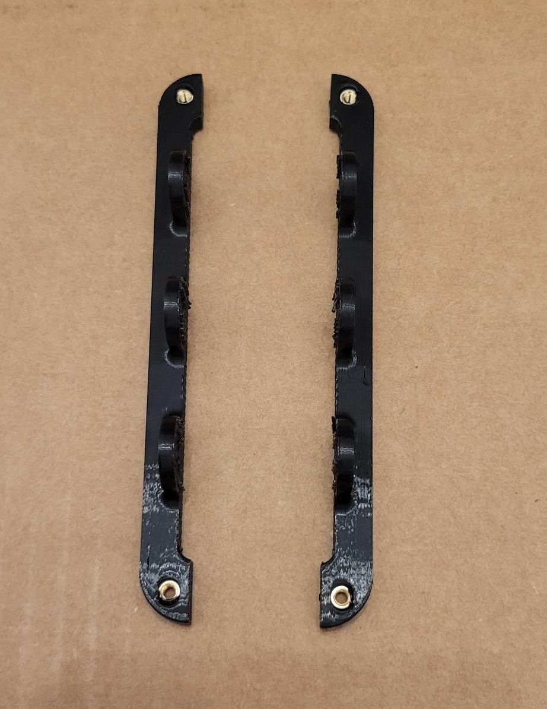

Place 3x inserts into each HDD mounting bracket
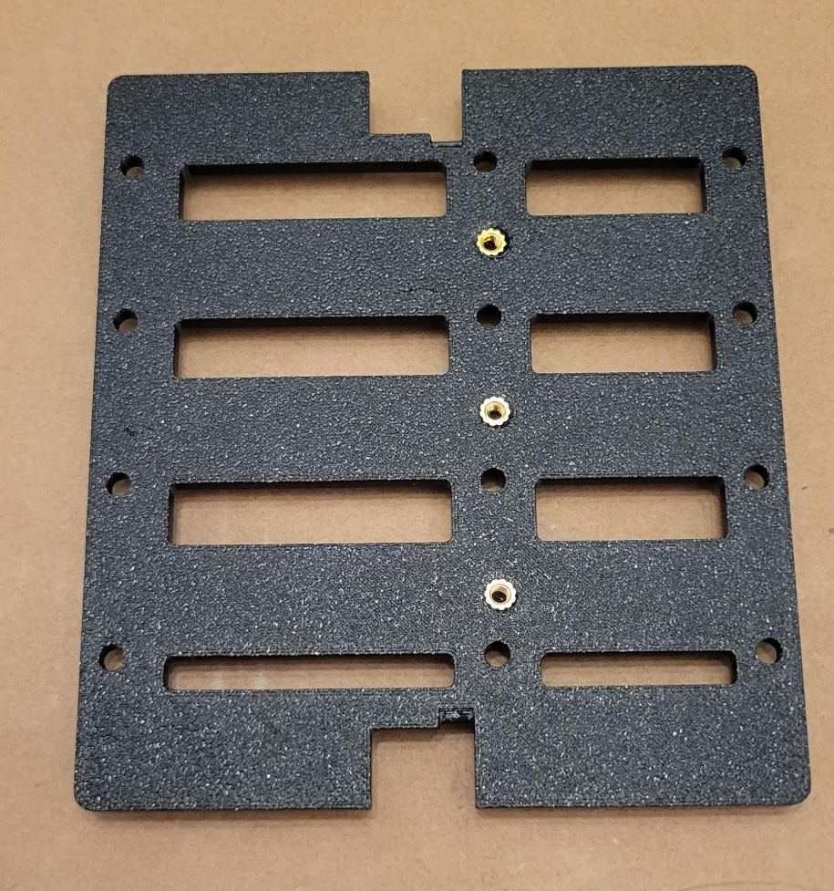

Place 4x inserts into the top of each top/bottom ring
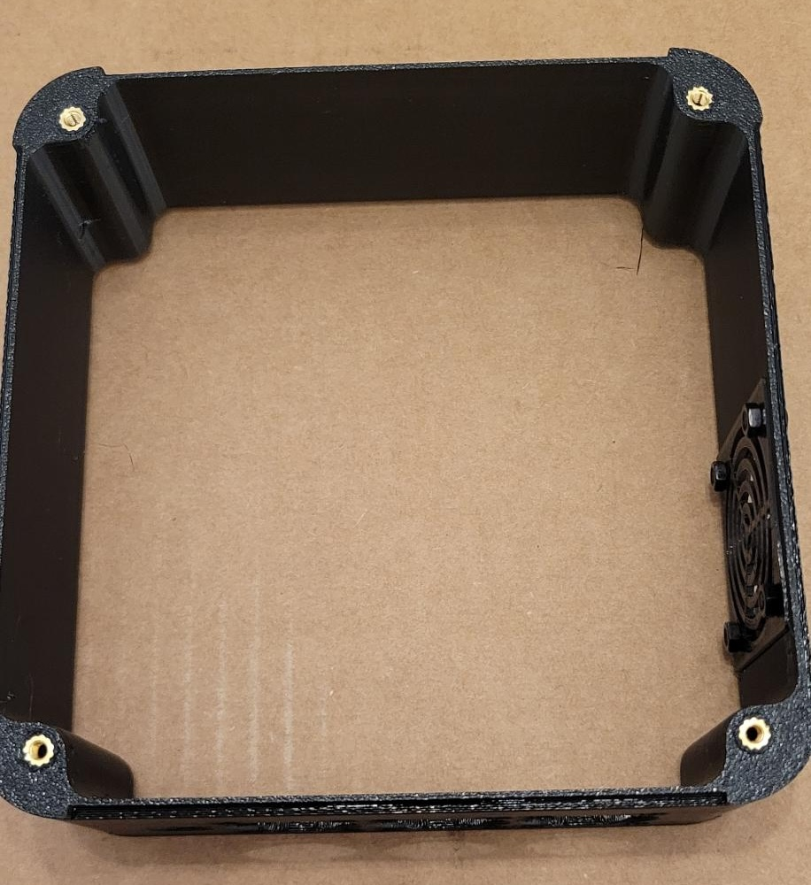

Place 4x inserts into the underside of each top/bottom ring
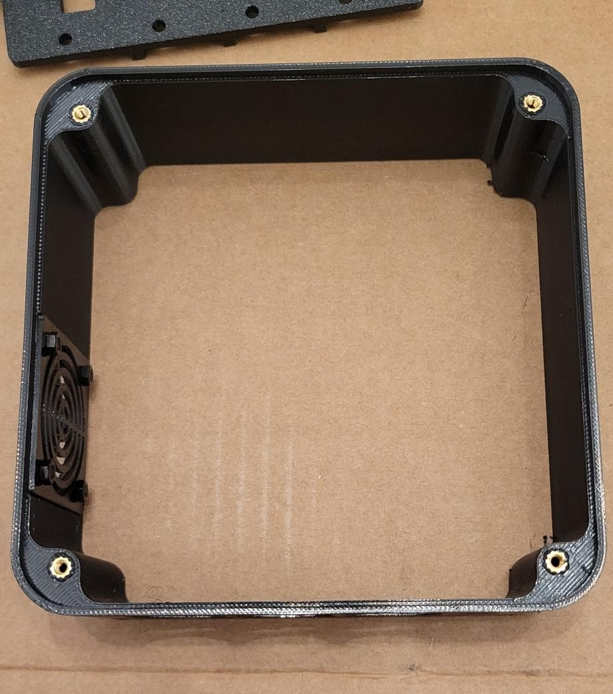

## Side Frame Assembly

**Parts for this step**
- (2x) HDD Side Bracket
- (4x) Side Pillar 
- (4x) TODO mm M3 bolts

Once you have placed the threaded inserts into the components, the next step is to mount the HDD side bracket to the corner pillars. 

Place 4x inserts into the underside of each top/bottom ring

Take a TODO mm screw and begin threading it into the middle screw hole (see the left image). Repeat this step for a second corner pillar and then fully screw the bolts into the inserts of the HDD bracket (see the right image). Repeat this step for the second set of corner pillars and HDD side bracket. 

  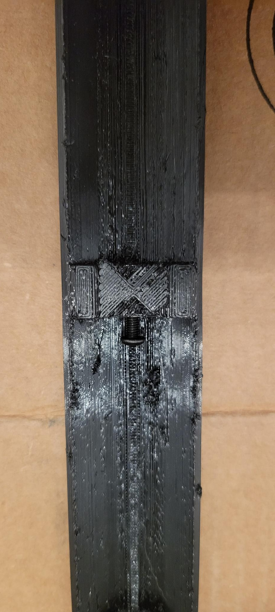
  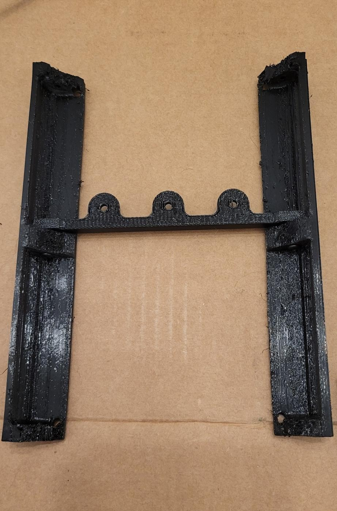

## Mounting the Side Frame to The Top/Bottom Ring

**Parts for this step**
- (2x) Side Frame Assembly
- Bottom Ring
- Top Ring
- (8x) TODO mm M3 bolts
 
Once you have completed both side frames, use TODO mm bolts to attach the corner pillars to the bottom ring. It is important that the tabs on the HDD side bracket are facing downwards towards as shown in the image.

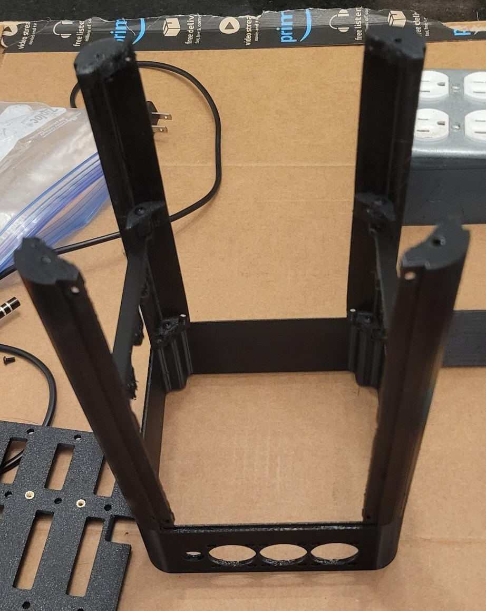

Next, use TODO mm bolts to attach the Top Ring to the other end of the 4 pillars. The resulting assembly will look like this: 
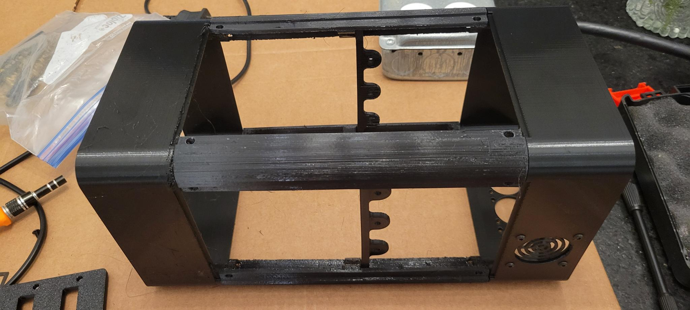

## Attaching the HDD Mounting Bracket
**Parts for this step**
- Current Assembly
- HDD Mounting Bracket Left
- HDD Mounting Bracket Right
- (6x) TODO mm M3 bolts

With the top and bottom rings attached, now use 3x TODO mm bolts to attach the HDD Mounting Bracket to the HDD Side Bracket as shown in the following image. Do the same thing for the other side as well.

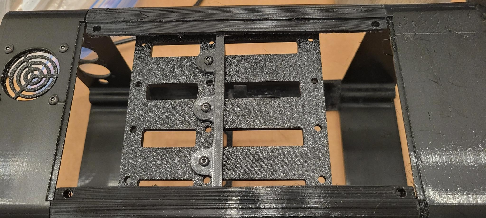

In this image you can see what the assembly looks like from the opposite side.
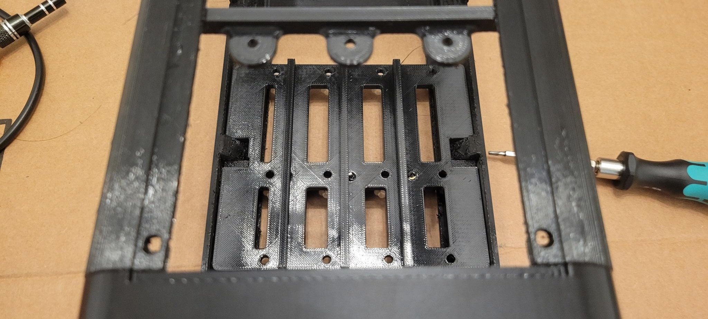

The assembly is snug, but the tabs on the HDD Side bracket are designed to accommodate the pillar and the HDD Side Bracket and it should fit together like this:
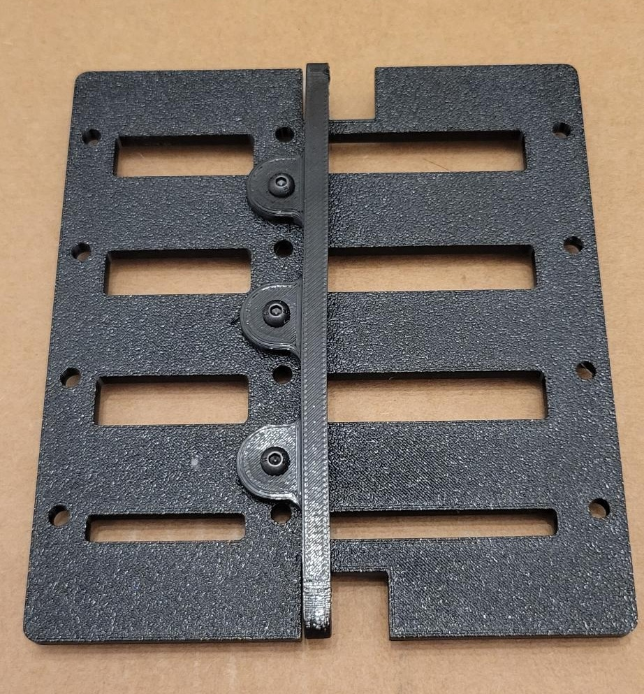

## Base Assembly
**Parts for this step**
- Raspberry Pi
- (4x) TODO mm standoffs
- HDMI plate port
- USB-A plate port
- Ethernet plate port
- 12v DC plate port 
- 4x TODO mm M3 bolts

There are two variants of the NAS that allow for vertical and horizontal storage. The following image shows the primary base assembly for horizontal orientation. 

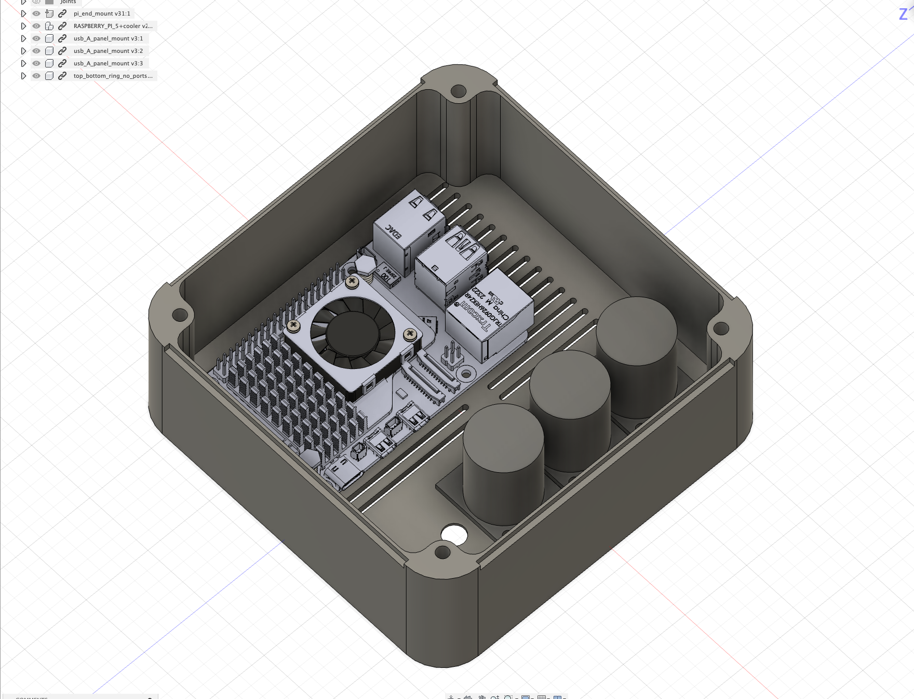

Alternatively, you can use the alternate base assembly which places the ports on the side of the case to allow for a vertical orientation. Please note that the placement of the drives in the vertical orientation makes it slightly top heavy.
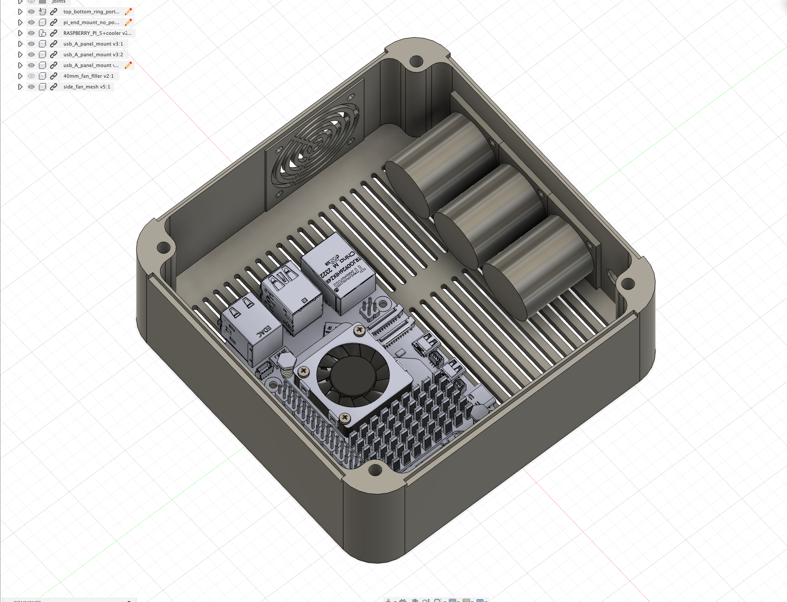

At this point in the assembly, it is time to mount your Raspberry Pi, and the connectors as shown in one of the above images.

## Mounting the Drives

# Software Setup