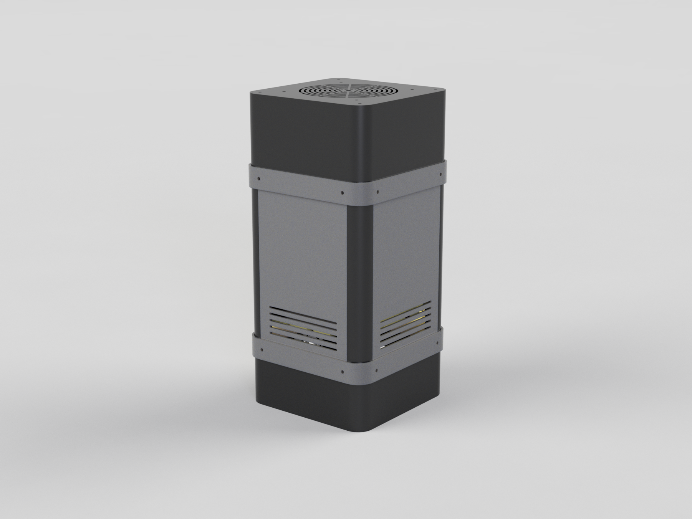

# Raspberry Pi NAS Case

I recently saw an interesting [video](https://www.youtube.com/watch?v=l30sADfDiM8) by Jeff Geerling where he built a NAS using a Raspberry Pi and 4x SSDs. I thoroughly enjoyed the project and thought that I would build my own. Unfortunately, SSDs are expensive and I wanted a NAS with 8TB of storage in a RAID 10 configuration. If I were to use 2.5\" SSDs that would cost ~800USD, whereas the equivalent using  using 3.5" HDDs would only cost ~340USD. 

There are some very nice 3D printed designs for a NAS using 2.5" drives: 
- https://www.printables.com/model/1344785-raspberry-pi-5-radxa-penta-sata-hat-nas-case
- https://makerworld.com/en/models/464746-raspberry-pi-5-four-bay-nas#profileId-375411
- https://makerworld.com/en/models/1450662-nas-case-radxa-penta-sata-hat-raspberry-pi-5#profileId-1511066

I was also able to find this design for 3.5" drives:
- https://makerworld.com/en/models/507716-raspberry-pi-5-nas-radxa-penta-sata-hat#profileId-423445

I only have a Prusa Mini which has a build volume of 180mm$\times$180mm$\times$180mm which is unable to accommodate the above design. So I designed my own case that can accommodate 3.5" drives and be printed on a mini-sized printer. 

The files for this project can be found here: [Radxa Penta SATA Hat Raspberry Pi NAS 3.5" HDD](https://www.printables.com/model/1346682-radxa-penta-sata-hat-raspberry-pi-nas-35-hdd). 

The goal of this article is to walk through the assembly process for the case. I would recommend checking out the resources listed at the bottom of this page for more in-depth information about how to setup OpenMediaVault for the operating system of your NAS.

# Purchasing

NOTE: These are not affiliate links. These are just the parts that I used.
- (4x) [30cm male to female SATA power+ data extension cable](https://shop.allnetchina.cn/products/sata-power-and-data-extension-cable?variant=31491388768358)
- (1x) [Radxa Penta SATA HAT for Raspberry Pi 5](https://radxa.com/products/accessories/penta-sata-hat/)
- (4x) [3.5" HDD](https://www.amazon.com/dp/B09NHV3CK9?ref_=ppx_hzsearch_conn_dt_b_fed_asin_title_2&th=1)
- (1x) [Raspberry Pi 5](https://www.raspberrypi.com/products/raspberry-pi-5/)
- (1x) [Raspberry Pi Active Cooler](https://www.raspberrypi.com/products/active-cooler/)
- (1x) [92mm fan](https://www.amazon.com/dp/B07DXTN515?ref_=ppx_hzsearch_conn_dt_b_fed_asin_title_1)
- (1x) [6" HDMI to 90$^\circ$ micro HDMI cable](https://www.amazon.com/dp/B08QFMMHB7?ref_=ppx_hzsearch_conn_dt_b_fed_asin_title_1&th=1)
- (1x) [HDMI passthrough panel connector](https://www.amazon.com/dp/B09WM99BF6?ref_=ppx_hzsearch_conn_dt_b_fed_asin_title_1&th=1)
- (2x) [6" USB-A to USB-A cables](https://www.amazon.com/dp/B07BZ2M3WM?ref_=ppx_hzsearch_conn_dt_b_fed_asin_title_8&th=1)
- (1x) [USB-A passthrough panel connector](https://www.amazon.com/dp/B09FL99YL6?ref_=ppx_hzsearch_conn_dt_b_fed_asin_title_8)
- (1x) [RJ45 passthrough panel connector](https://www.amazon.com/dp/B09Z2977RZ?ref_=ppx_hzsearch_conn_dt_b_fed_asin_title_1&th=1)
- (1x) [6" RJ45 cable](https://www.amazon.com/dp/B07MVS5NRT?ref_=ppx_hzsearch_conn_dt_b_fed_asin_title_4)
- (26x) [M3 Threaded inserts](https://www.amazon.com/dp/B0CYL92VTF?ref_=ppx_hzsearch_conn_dt_b_fed_asin_title_1)
- (1kg) [PETG Filament](https://www.amazon.com/HATCHBOX-3D-Filament-Dimensional-Accuracy/dp/B014VM95IK/ref=sr_1_4_pp?crid=10I4FOAQUUDS6&dib=eyJ2IjoiMSJ9.j2b3XXrp_Si9Hzg9O9YaaeotcD10RvXCkHBnma-VgRvro1dwFsPyZF-_dtAjNziGJyubbvmSCC5MXD4ZALJZc_7dm0IVClpDez2HmdsQZCm6hxU2h8xeny__OtM4a7LY-CipMBwYjP6otsg_P2--27Gje6jETPxlNA7ESnBUpCvgxDRy9E4nZfzhsFteWDY3ZCzp5V6GpDNzyHZPj81GJJ-kSprYqVRDoNYbRnMhCrYErNKaCBfBHpOmxtbSWlCCZC-hrp3E53x35e3LN_OZSbD9UPP8cuBPr98s4ReQDlE.X9fW6MjxutXjY_zDyhlLboEHmDC5RGCicjN2Hs1isiI&dib_tag=se&keywords=petg&qid=1751720736&s=industrial&sprefix=pet%2Cindustrial%2C135&sr=1-4&th=1)
- (1x) 12V-DC 5525 plate connector
- (1x) 12V-DC 5525 pigtails
- [12v 5A DC Power Supply](https://www.amazon.com/dp/B01GEA8PQA?ref_=ppx_hzsearch_conn_dt_b_fed_asin_title_1)

# Printing
I used PETG for my filament because it has better longevity; however, none of the components get hot in the NAS, so you should be fine to use PLA if you don't have access to PETG. 

Print out the following parts:
- (2x) case_to_hdd_bracket
- (1x) hdd_bracket_side
- (1x) hdd_bracket_side_mirror
- (4x) shell_corners (see note)
- (4x) side_plate_solid OR side_plate_B (see note)
- (1x) fan_extender
- (1x) fan_end_mount
- (2x) bounding_ring

There are two variants of the NAS that allow for vertical and horizontal orientation. The following image shows the primary base assembly for horizontal orientation. 

Alternatively, you can create a NAS in the vertical orientation which places the ports on the side of the case. Please note that the vertical orientation makes the NAS slightly top heavy.

**For Horizontal Orientation**
- (1x) pi_end_mount
- (2x) top_bottom_ring_no_ports

**For Vertical Orientation**
- (1x) pi_end_mount_no_ports
- (1x) top_bottom_ring_no_ports
- (1x) top_bottom_ring_ports
- (1x) side_fan_mesh

*Note about corner pillars*
To print the corner pillars on a small build plate, you will need to print them one at a time and rotate them 45$^\circ$ diagonally across the build plate.

*Note about side plate*
There are two variants of the side plate: one with vents and one without vents. In my testing, I found that the CPU temperature was lower using the side_plate_solid instead of side_plate_B which has vents.  

# Assembly

## Threaded Inserts

**Parts for this step:**
- 26 Threaded Inserts
- Top Ring
- Bottom Ring
- hdd_bracket_side
- hdd_bracket_side_mirror
- (2x) case_to_hdd_bracket

The first step in the assembly is to place the threaded inserts into the various components.

Place 2x threaded inserts into the case_to_hdd_bracket

Place 3x inserts into the hdd_bracket_side and hdd_bracket_side_mirror

Place 4x inserts into the top of each top/bottom ring

Place 4x inserts into the underside of each top/bottom ring

## Side Frame Assembly

**Parts for this step**
- (2x) case_to_hdd_bracket
- (4x) Side Pillar 
- (4x) 16mm M3 bolts

Once you have placed the threaded inserts into the components, the next step is to mount the HDD side bracket to the corner pillars. 

Take a 16mm bolt and begin threading it into the middle screw hole (see the left image). Repeat this step for a second corner pillar and then fully screw the bolts into the inserts of the HDD bracket (see the right image). Repeat this step for the second set of corner pillars and case_to_hdd_bracket. 

  
  

## Mounting the Side Frame to The Top/Bottom Ring

**Parts for this step**
- (2x) Side Frame Assembly
- Bottom Ring
- Top Ring
- (8x) 10mm M3 bolts
 
Once you have completed both side frames, use  10mm bolts to attach the corner pillars to the bottom ring. It is important that the tabs on the case_to_hdd_bracket are facing downwards towards as shown in the image.

Next, use  10mm bolts to attach the Top Ring to the other end of the 4 pillars. The resulting assembly will look like this: 

## Attaching the HDD Mounting Bracket
**Parts for this step**
- Current Assembly
- hdd_bracket_side
- hdd_bracket_side_mirror
- (6x)  6mm M3 bolts

With the top and bottom rings attached, now use 3x  6mm bolts to attach the HDD Mounting Bracket to the case_to_hdd_bracket as shown in the following image. Do the same thing for the other side as well.

In this image you can see what the assembly looks like from the opposite side.

The assembly is snug, but the tabs on the HDD Side bracket are designed to accommodate the pillar and the HDD Side Bracket and it should fit together like this:

## Base Assembly
**Parts for this step**
- Raspberry Pi
- HDMI passthrough connector
- USB-A passthrough connector
- Ethernet passthrough connector
- 12v DC passthrough connector 
- (4x) 6mm M3 bolts
- (4x) 6mm M2.5 bolts
- (4x) 5mm M2.5 M-F standoffs
- (4x) 18mm M2.5 M-F standoffs
- (4x) M2.5 nuts

The current case design does not allow for easy access to the SD card on the Raspberry Pi. Before you mount the Raspberry Pi, you should flash the SD card and get your OpenMediaVault installation setup.

As noted above, there are two variants of the NAS for either horizontal or vertical orientations. The instructions for this step are the same for both, but some of the cable lengths may differ.

Once your OS is setup, use the M2.5 standoffs, bolts and nuts to mount your Raspberry Pi.

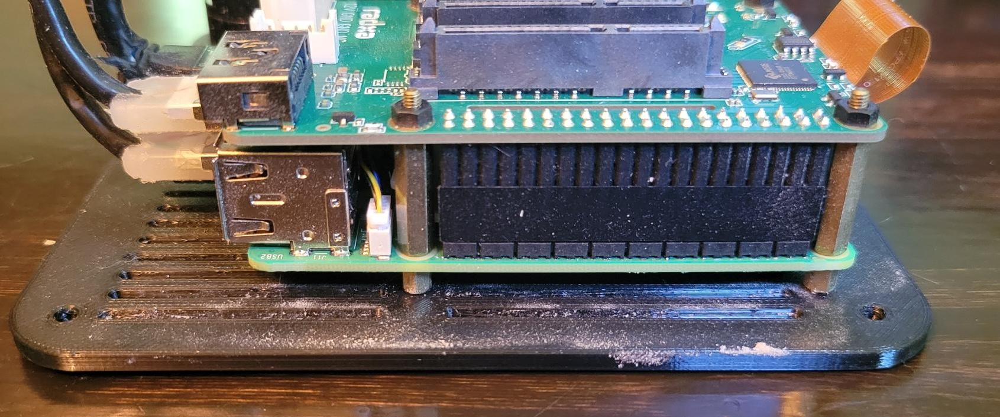

Next, use the included hardware to mount all three passthrough connectors. Also, solder a jumper to connect the 12V DC connector from the plate-mount port to the Penta SATA Hat.

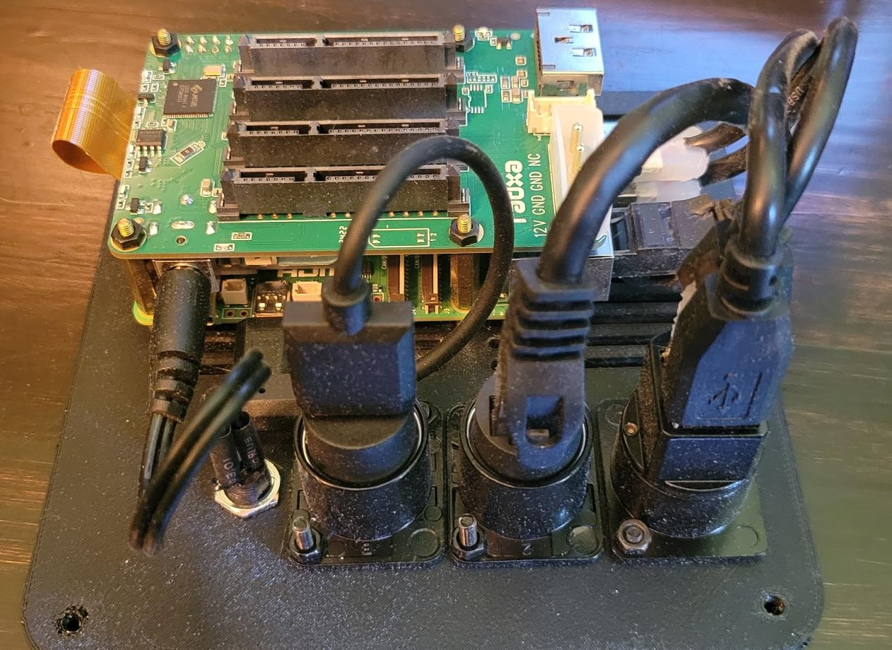

Finally, connect the short jumper cables between the passthrough connectors and the Raspberry Pi
 
 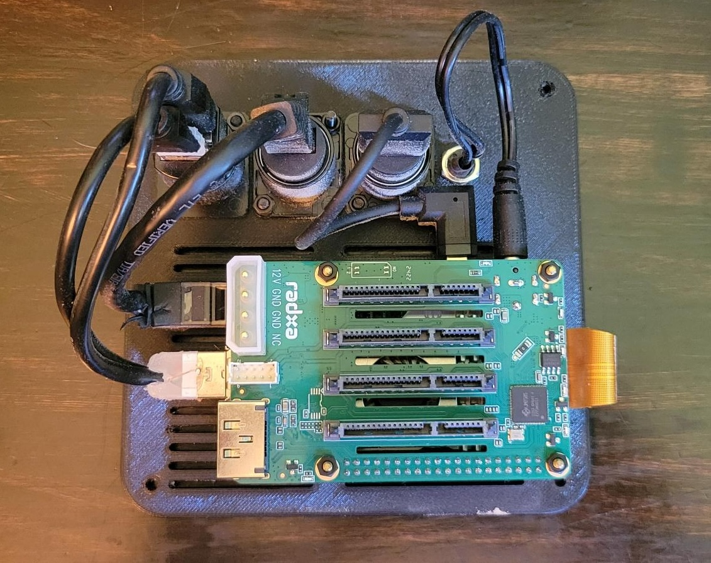
 

Finally, use 4x 6mm M3 bolts to attach the Raspberry Pi plate to the bottom ring of the case. 

 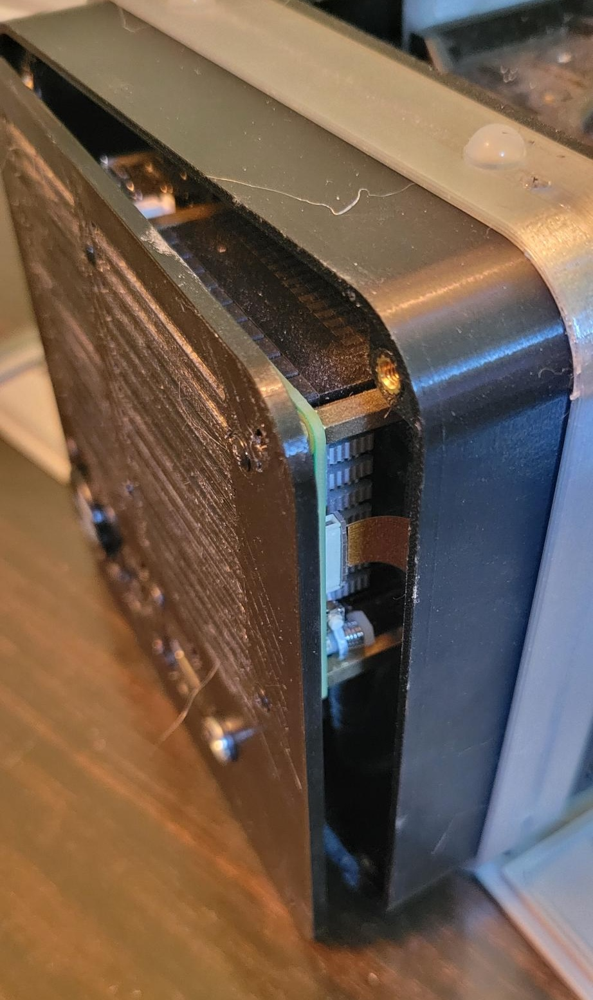

NOTE: make sure that the SATA ports on the hat are parallel with the orientation of the drives.

At this point, the bottom of the case should look like this: 

 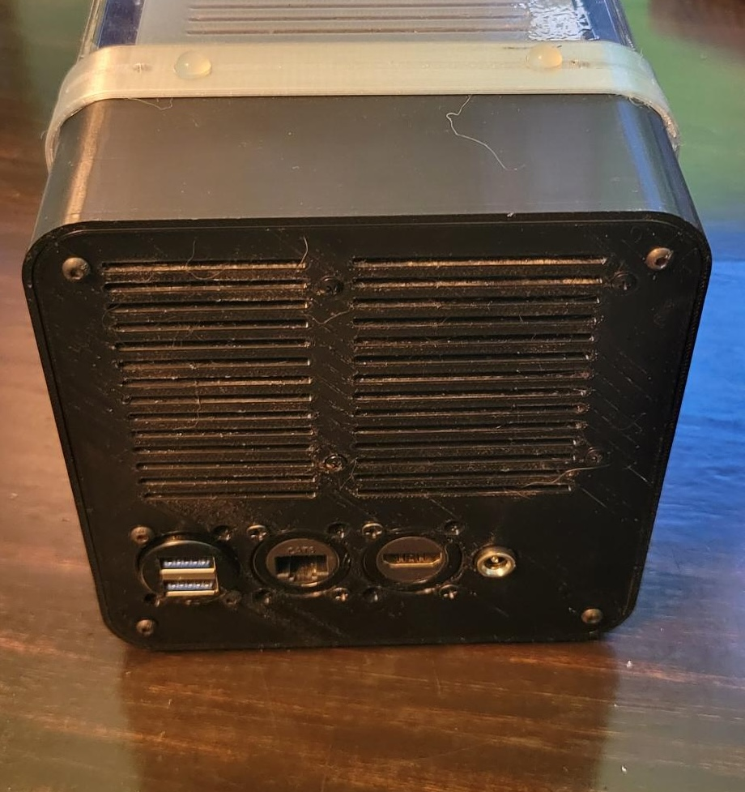

## Mounting the Drives
**Parts for this step**
- Current Assembly
- (4x) [30cm male to female SATA power+ data extension cable](https://shop.allnetchina.cn/products/sata-power-and-data-extension-cable?variant=31491388768358)
- (4x) [3.5" HDD](https://www.amazon.com/dp/B09NHV3CK9?ref_=ppx_hzsearch_conn_dt_b_fed_asin_title_2&th=1)

First, attach each cable to a drive. Next, with the case on its side, slide the drives in one at a time starting from the bottom. The drive's cable port should be on the side *opposite* of the Raspberry Pi and you should route the cable under the drive as you slide it into place. Use the fasteners that came with your drive to screw it into place. Finally plug the drive into the SATA hat. Getting your fingers inside to plug in the SATA port may be a tight squeeze, so I recommend plugging each drive as you put it into the case.

Here you can see the drives mounted in place from the side

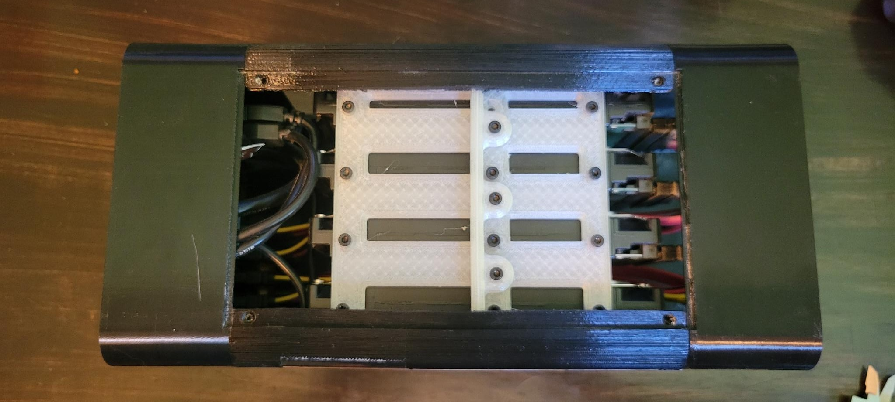

And here you can see the drives from the front
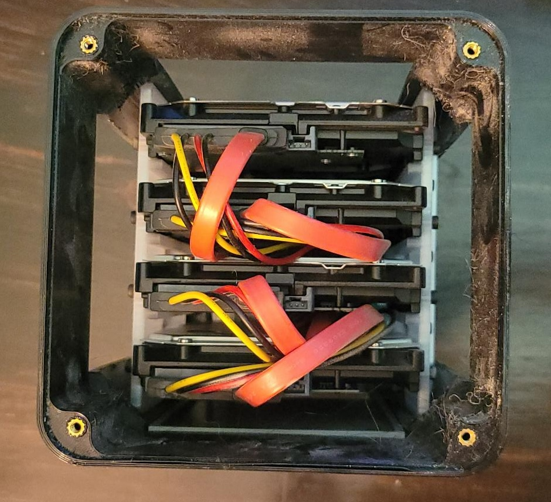

Finally, this image shows the SATA connectors plugged into the Raspberry Pi

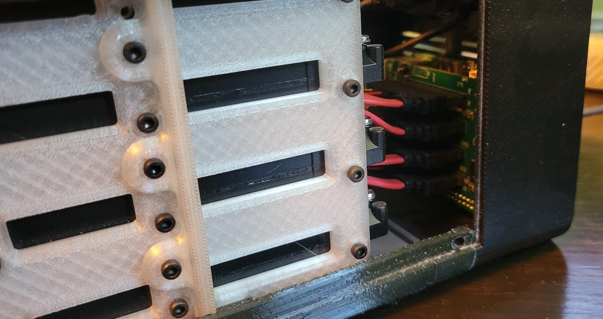

## Mounting the Fan
**Parts for this step**
- Current Assembly
- (1x) [92mm fan](https://www.amazon.com/dp/B07DXTN515?ref_=ppx_hzsearch_conn_dt_b_fed_asin_title_1)
- (1x) fan_extender
- (1x) fan_end_mount
- (4x) 30mm M3 bolts
- (4x) 15mm M3 bolts
- (4x) M3 nuts

Use the 15mm M3 bolts and M3 nuts to mount the fan to the fan_end_mount so that the fan is blowing outwards.

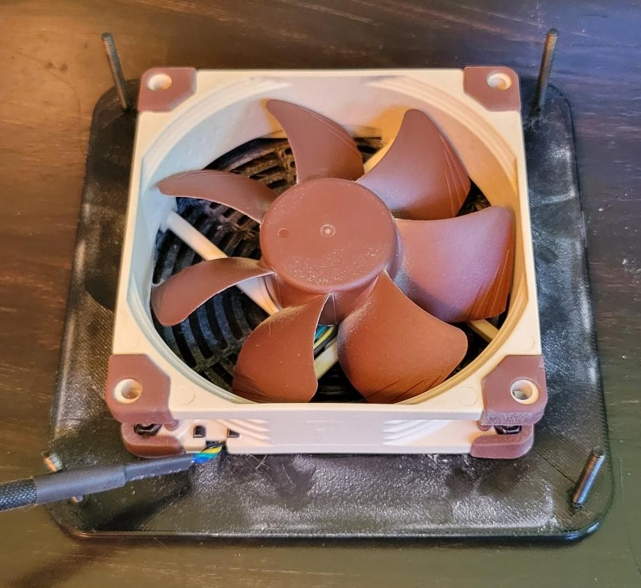

 Next, thread the 30mm M3 bolts bolts through the fan_end_mount and through the fan_extender (the bolt should pass through smoothly). 

 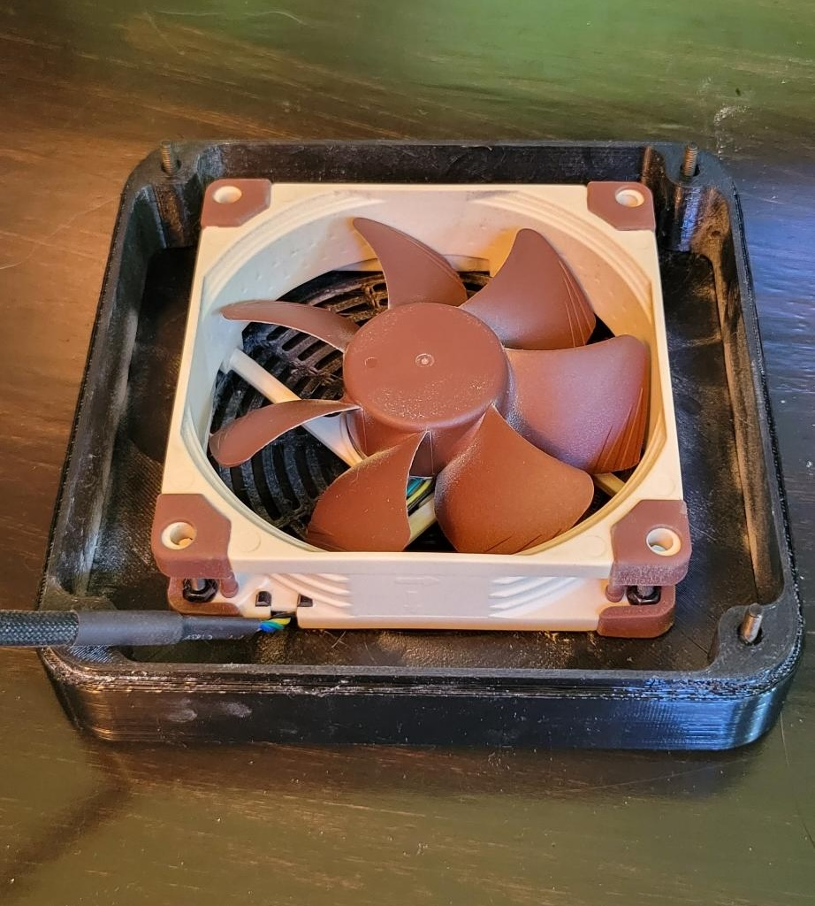

Next, place the fan assembly on to the end of the current case assembly and tighten the four corner bolts into the rest of the case. In my setup I have the fan connected to one of the extra USB ports on the Raspberry Pi for power. To acheive this, route the fan's cable all the way through the case and connect it to the Raspberry Pi.

 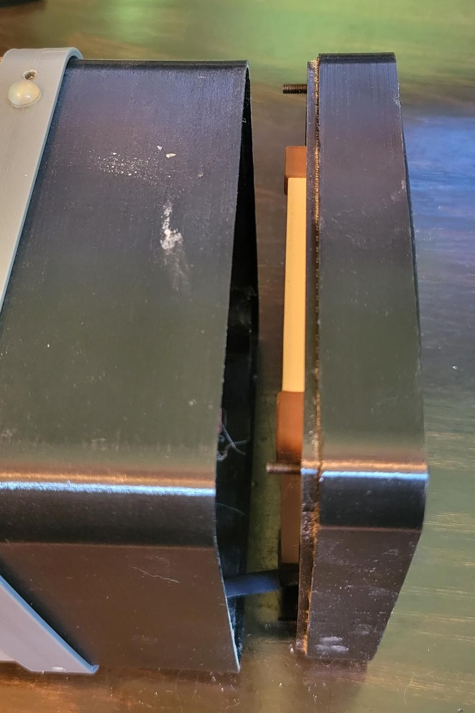

## Side Plates and Bounding Ring
**Parts for this step**
- Current Assembly
- (4x) Side plates
- (2x) Bounding rings

The design of the case has an ugly seam where the corner_pillars meet the ends of the case. The purpose of the bounding rings is to cover this seam to make the case look slightly cleaner. The final step in the assembly is to place all four side plates onto the case, then slide the bounding rings over the seam. Finally, pass bolts through the bounding ring and thread into the corner pillars. NOTE: the corner pillars do not have inserts, so don't over tighten the bolts.

 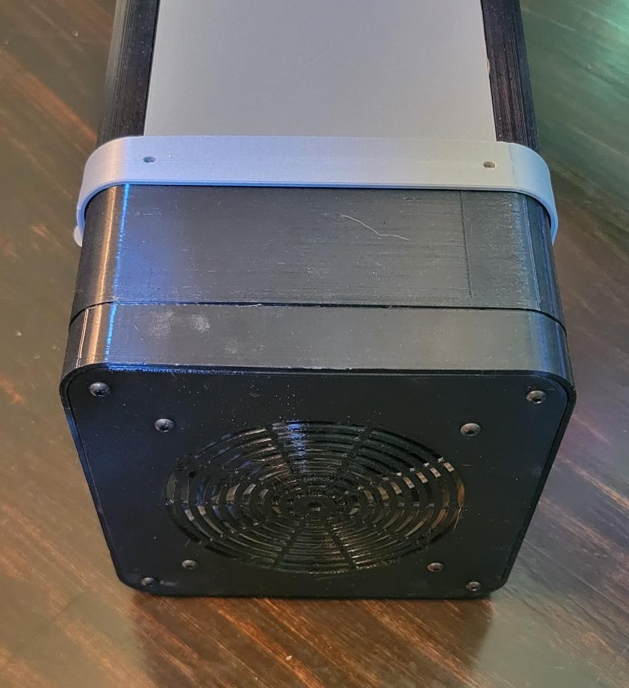

# Operating Temperature

With the fan attached, the temperature inside the case usually stays below 40$^\circ$C.

  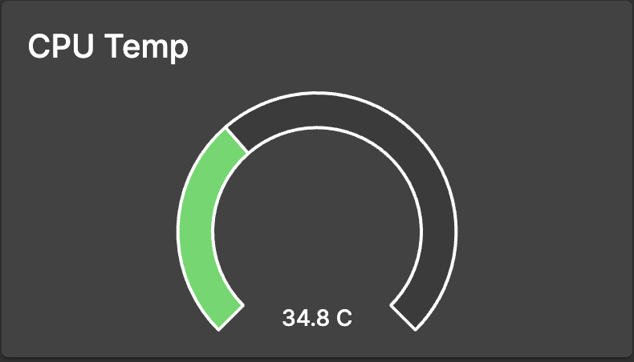
  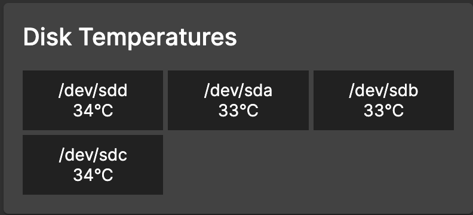

# Conclusion

At this point, you have completed the case assembly and are ready to setup the software portion of your NAS. To learn more about setting up OpenMediaVault and other open sourced projects, checkout the links below. 

# Helpful Resources
- [Inspiration video from Jeff Geerling](https://www.youtube.com/watch?v=l30sADfDiM8)
- [Radxa Penta Sata Hat docs](https://docs.radxa.com/en/accessories/penta-sata-hat)
- [OpenMediaVault](https://www.openmediavault.org/)
- [Linus Tech Tips video about OMV](https://www.youtube.com/watch?v=QsM6b5yix0U)
- [immich](https://immich.app/)

