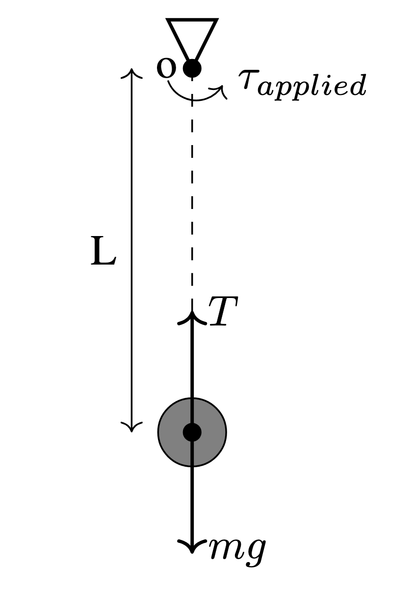
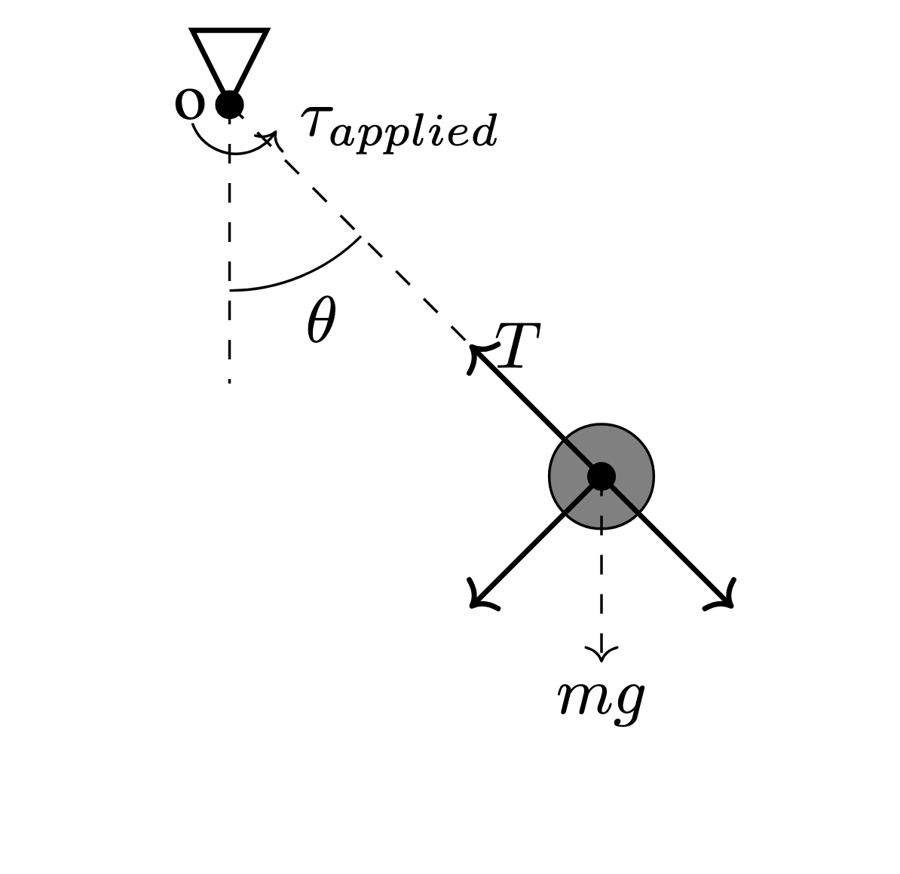
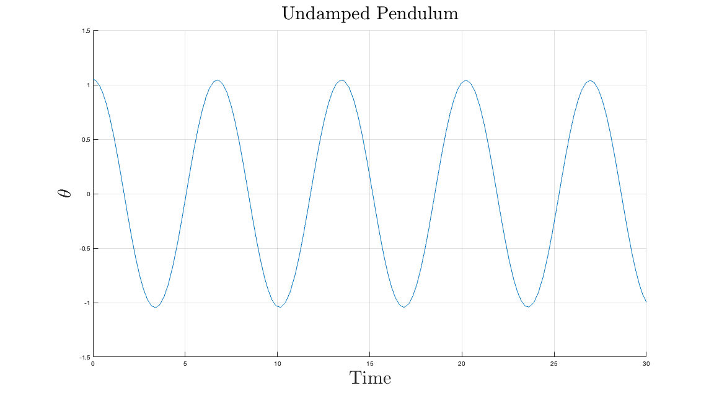
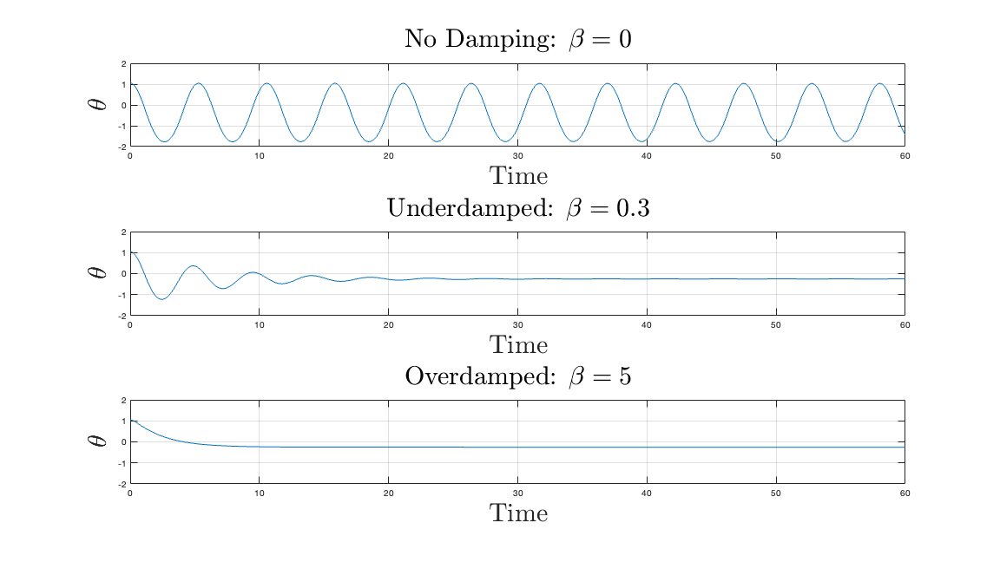
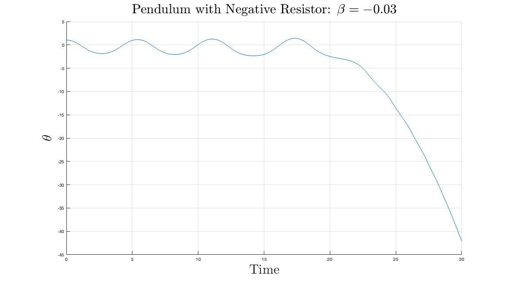
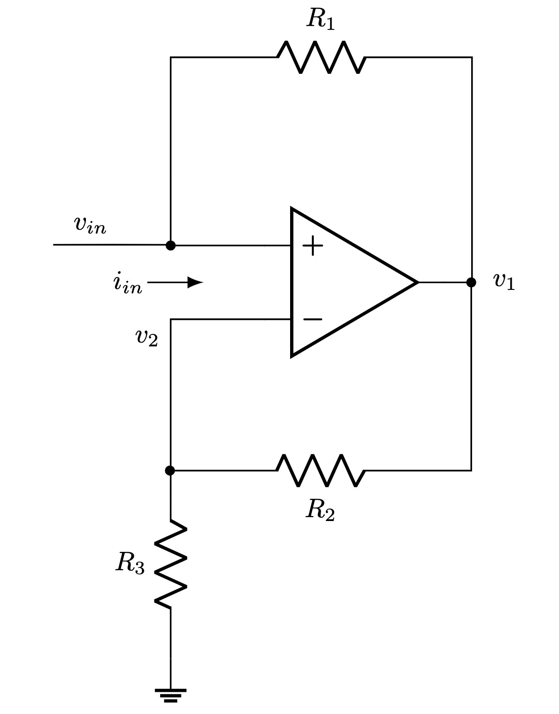
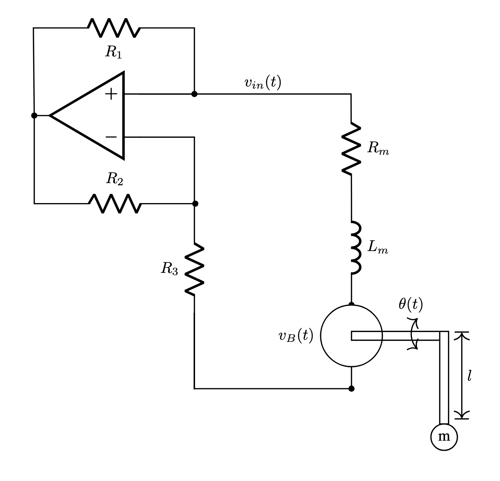

# Negative Friction Pendulum

## Motivation

Pendulums can be found in many physics or engineering classrooms. The simple mechanism is an excellent tool to illustrate, among other things, angular motion, conservation of energy, and periodicity. The main goal of this project is to take a normal, damped pendulum, and apply a negative impedance converter to create a pendulum with *negative* friction.

## Theory
### Simple Pendulum Motion
When a pendulum is at rest, the tension of the rod and the weight of the pendulum are in direct opposition resulting in a static system.

 When the pendulum is raised to one side and then released, the weight of the pendulum creates a moment about the origin of the pendulum resulting in angular motion.

Mathematically, we can describe this behavior with Newton's Second Law: $\tau = I\ddot{\theta}$. Using this equation and the free body diagram for the displaced pendulum, we can determine the sum of moments about the origin. In the following equation, $m$ is the mass of the pendulum, $g$ is the acceleration of gravity, $L$ is the length of the pendulum and $\theta$ is the angle of the pendulum. While there is a term for $\tau_{applied}$ in the equation, we will ignore it for now and assume it is zero.

$$
    \sum \tau_o = mgLsin(\theta) + \tau_{applied} = I\ddot{\theta}
$$ 

Using a program like MATLAB and the above equation, a plot can be created to describe the behavior of a simple pendulum. At this point, we have neglected friction and as a result, this idealized pendulum will swing forever.

### Friction on the Pendulum

In the real world world where friction exists, an additional element in terms of angular velocity ($\dot{\theta}$) must be included. The following equation can be used to calculate the motion of a pendulum with friction. 

$$
    mgLsin(\theta) - \beta \dot{\theta} + \tau_{applied} = I\ddot{\theta}
$$

Using this equation, we can start to categorize the behavior of the pendulum based on the magnitude of the coeffecient of friction, $\beta$.

Based on Fig. \ref{fig:damping_behavior} we can see that increasing the friction causes damping behavior in the pendulum. A larger coefficient of friction causes the pendulum to converge to the fixed point faster. 

If a positive coefficient of friction results in decaying behavior, it's easy to see how a negative coefficient of friction should result in growth in the pendulum's swing. This concept is illustrated in the following figure by using a coefficient of friction with a negative sign.  

It should be noted that when the pendulum crosses $\theta = \pi$, the growth explodes exponentially.This threshold corresponds with the pendulum going over the top, at which point it begins spinning uncontrollably.

## Real World Implementation

In the previous sections, we have reviewed the equations of motion for a simple pendulum and discussed the effect of positive and negative friction on the pendulum's behavior. Now that the background information has been presented, we will transition to a discussion of the physical components necessary to build a real-world negative friction pendulum. 

### Motor Characteristics

In our negative friction pendulum we will use a DC motor to make the connection between the electrical and mechanical components of our system.  When the stator of the motor is rotated, the motion of the stator moving by the coils of the motor results in an induced voltage called back EMF. The back emf will be the the mechanism that allows us to increase the friction of the system. Based on information found in the datasheets of most DC motors, the following equation can be used to determine the magnitude of the back EMF.

$$
    V_b(t) = K_B \frac{d\theta}{dt}
$$

Next, we know that applying torque to a motor res motor causes rotation. The motor torque constant can be used to calculate the torque being applied to the pendulum as a function of current \cite{noauthor_permanent_nodate}. 

$$
    \tau_{motor} = K_m*i
$$

While not explicitly used in this paper, Eq. \ref{eq:motor_torque} will be used to determine the necessary current supply to set the fixed points of the switched pendulum.

### Negative Resistors and Negative Friction

The equation for rotational power is listed in the following equation where P = power, $\tau$ = torque, $\omega$ = angular velocity

$$
    P = \tau \omega = \tau \frac{d\theta}{dt}
$$

The equation for electrical power is: 

$$
    P = iV
$$

Ohm's law states: 

$$
    V = iR
$$

If we consider our motor as a converter between mechanical power to electrical power, then we can say for an ideal generator: 

$$
    P_{mechanical} = P_{electrical}
$$

$$
    \tau_{friction} \frac{d\theta}{dt} = iV
$$

Use Ohm's law to relate the resistor to the applied torque:

$$
    \tau_{friction} \frac{d\theta}{dt} = i^2R
$$

To maintain equilibrium, when R is increased, the $\tau_{friction}$ must also be increased to maintain the same rotational velocity: it's harder to spin the motor when the resistance is greater. 

As you may have experienced in your highschool physics class, attaching a resistor between the terminals of a motor results in an *increased* amount of friction. By the same concept, attaching a negative resistor to the motor would \textit{decrease} the friction. While there is no passive component that behaves as a negative resistor, the negative impedance converter (see below) is an active circuit that is behaves as a negative resistor. 

When a motor is connected to a negative impedance converter, the voltage potential created by the motor's back EMF results in current being supplied to the motor. The concept of negative resistance and negative friction is sometimes slippery to understand because it's not a naturally occurring phenomenon. The reader may find it helpful to make a connection between resistors and springs. 

Everyone is familiar with pressing on a spring, and feeling the opposing force. This behavior is mathematically described with the equation: $F = K\Delta X$. Having a negative spring in the real world, would be a spring with a *negative* modulus of elasticity. Functionally, this would mean that a person attempting to compress the spring would have their hand pulled by the spring and the spring would compress even farther: the negative spring would assist in its own compression.}.

To solve for the resistance of the negative impedance converter, assume $v_{in} = v_2$.

$$
    v_1 = v_{in} - R_1i_{in}
$$

$$
    v_{in} = v_1(\frac{R_3}{R_2 + R_3})
$$

$$
    v_{in} = (v_{in} - R_1i_{in})(\frac{R_3}{R_2 + R_3})
$$

$$
    v_{in}(1- \frac{R_3}{R_2 + R_3}) = -\frac{R_3R_1i_{in}}{R_2 + R_3}
$$

$$
    v_{in} = -\frac{R_3R_1}{R_2}i_{in}
$$

Notice that this takes the form of Ohms law, but the resistance term has a negative sign. 

