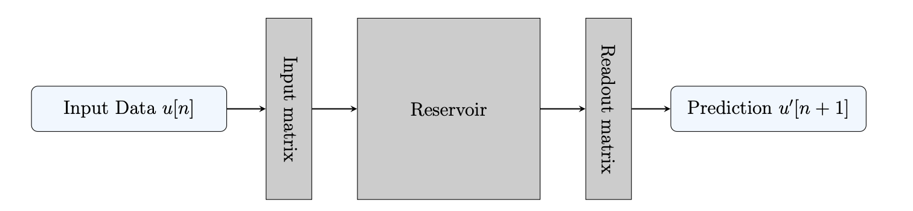
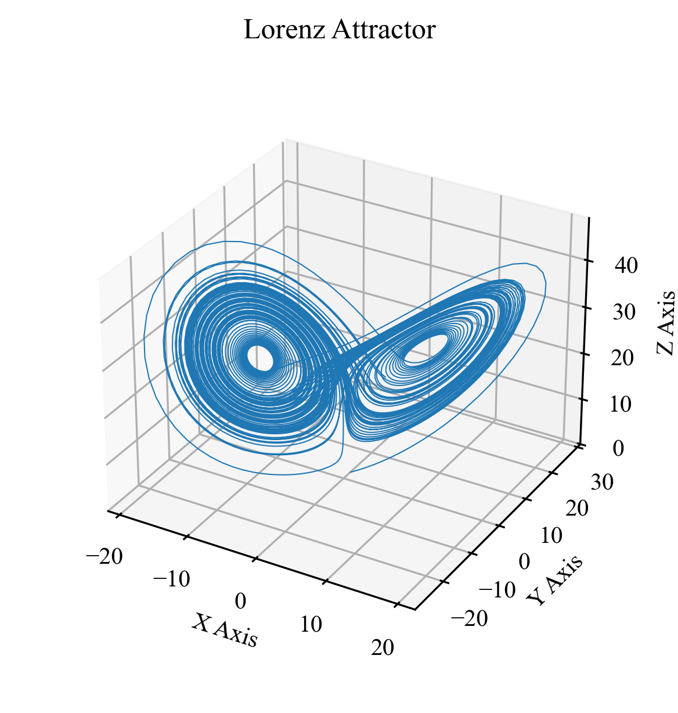
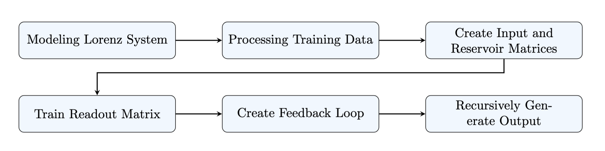
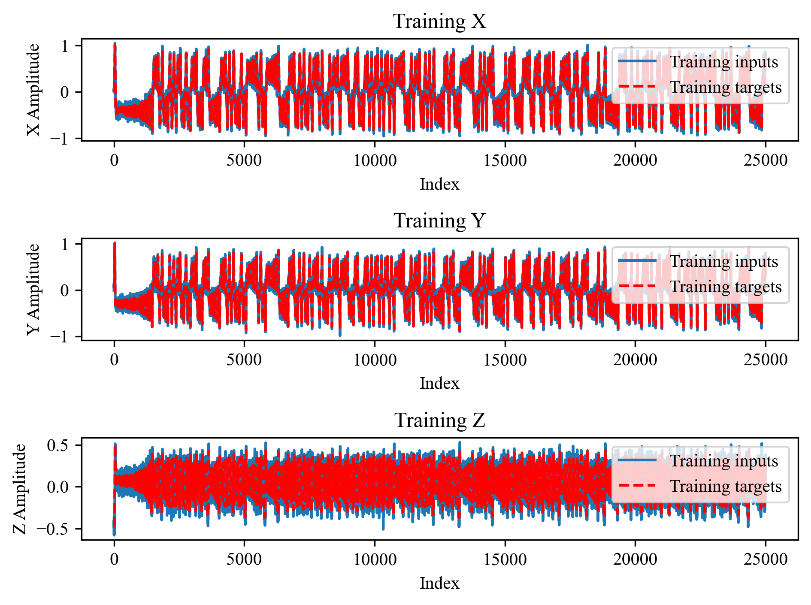
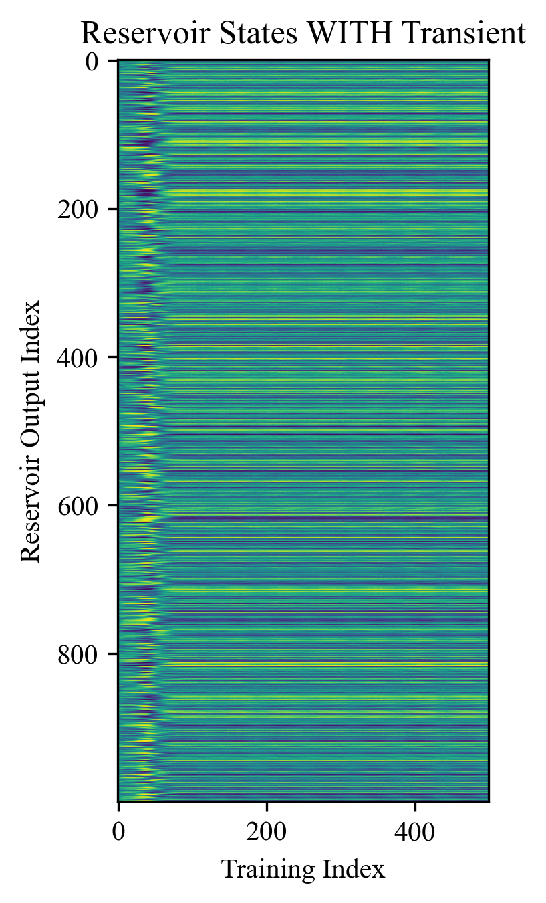
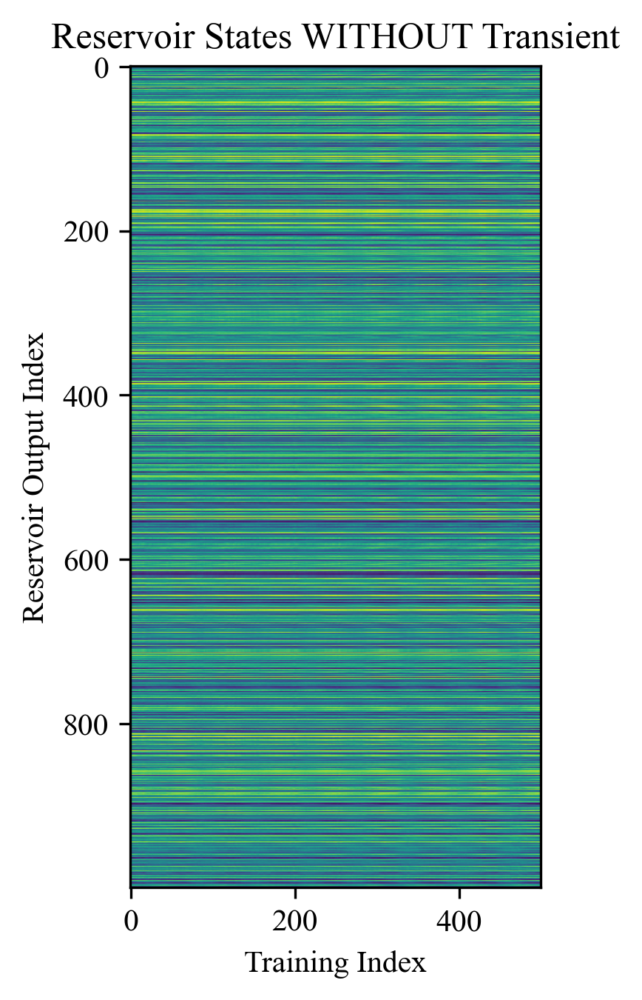
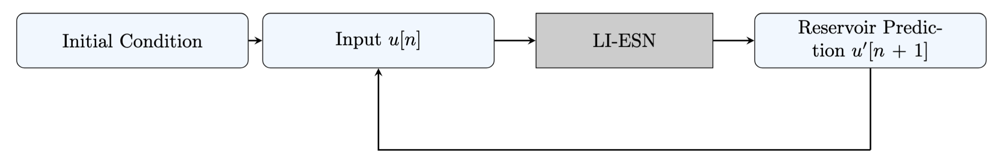
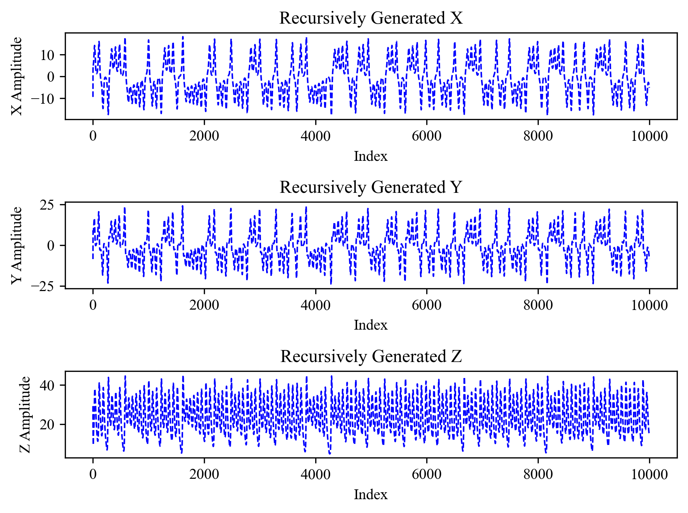
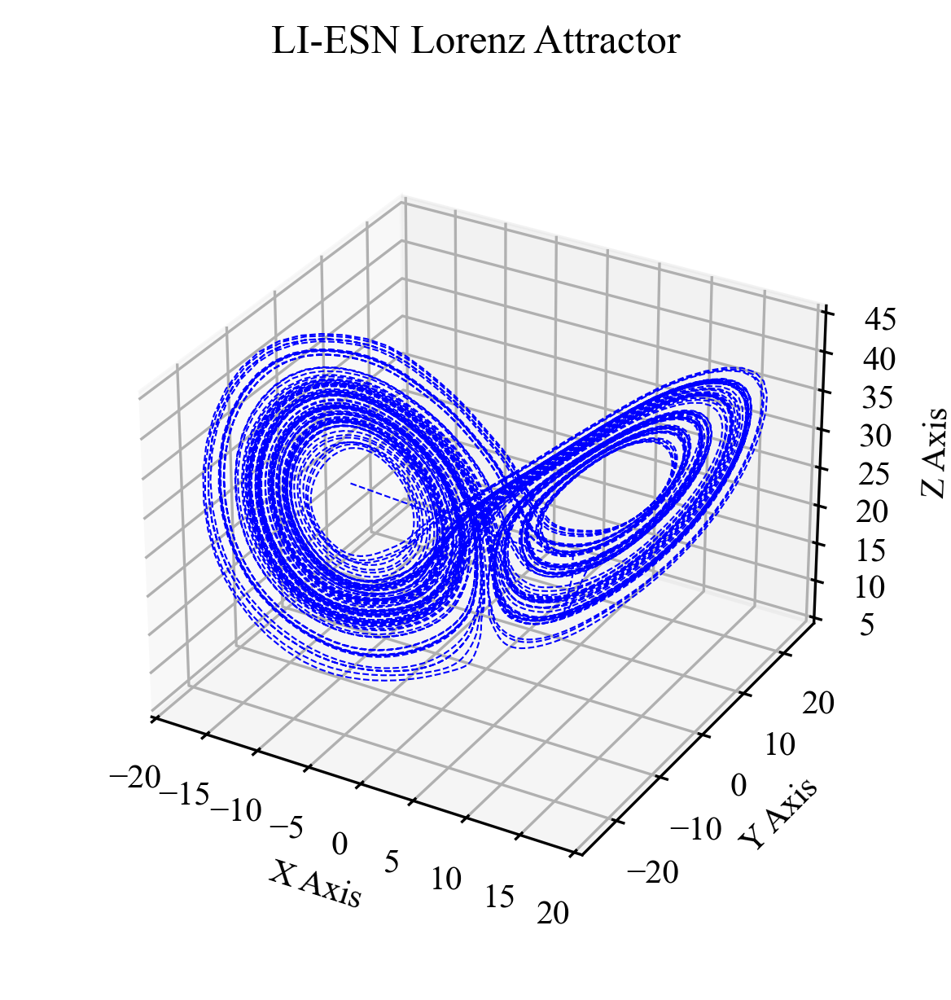

# Hands-On Tutorial: Leaky Integrator Echo State Network

## Motivation

This article presents a hands on tutorial for how to create a simple implementation of the Leaky Integrator Echo State Network (LI-ESN) in Python. One of the goals with this article is to write a custom implementation of the LI-ESN architecture while using minimal Python modules. While pre-existing packages provide more functionality, the reader can gain valuable intuition and understanding of LI-ESN by looking *under the hood*. A list of detailed research papers and existing python modules is included at the bottom of this article. I would highly recommend reading these papers to learn more about the field of reservoir computing (RC).

A public repo associated with this tutorial can be found at: [https://github.com/mattantseng-0/Tutorial_LI_ESN](https://github.com/mattantseng-0/Tutorial_LI_ESN). The repo contains a notebook that walks through all of the code discussed below. 

## Background
### Reservoir Computing

The following figure from [6] shows the high level signal flow for an RC. The three main components of this system are: Input Matrix, Reservoir, and Readout Matrix. The input matrix is a randomly instantiated matrix that matches the dimension of the input data to the size of the reservoir. 



The Reservoir is a dynamical system that evolves according to some nonlinear equation. For the LI-ESN, the nonlinear equation is as follows:

$$
x[n] = (1-a)x[n] + a\times \tanh(W_{in}u[n] + \hat{W}x[n-1])
$$

In the above equation, $x[n]$ is the state of the reservoir at index $n$, $u[n]$ is the input data at index $n$ and $a$ is a damping term called the leaky integrator factor.

Finally, the readout matrix is a trained matrix that remaps the output of the Reservoir into some predicted output. 

Each stage of the system can be described by considering the matrix dimensions: 

$$
\begin{split}
[I][I\times R][R \times R][R \times O] & = [O] \\
\end{split}
$$

Where $I$ is the number of input channels, $R$ is the size of the reservoir and $O$ is the size of the predicted output. For this tutorial, we will be making a 1-step forecast based on the given 3-state input. 


### The Echo State Property

Now you might be wondering: Can the Reservoir be *any* nonlinear system? It's generally accepted in literature that the Reservoir should exhibit certain characteristics [1]: 

- The system should forget its initial conditions
- The current output of the system should reflect the current input
- The system should forget old inputs

The combination of these characteristics make up what's called the Echo State Property (ESP). To be effective, a dynamical system used for a reservoir should maintain the ESP.

### The Lorenz System

The Lorenz System will be used as a test case for the LI-ESN. Originally introduced in [4] as a simplistic model for convective behavior, the Lorenz System has become almost synonomous with the field of nonlinear dynamics and chaos. The equations for the Lorenz System are shown in the following:

$$
\begin{split}
\frac{dx}{dt} & = \sigma (y-x) \\
\frac{dy}{dt} & = x(\rho - z) - y\\
\frac{dz}{dt} & = xy - \beta z\\
\end{split}
$$

The standard weights for the Lorenz System is shown in the following table.


| $\sigma$ | $\rho$ | $\beta$ |
|--------|-------|--------| 
| $10$ | $28$ | $\frac{8}{3}$ | 


When simulated with a numerical solver, the 3-dimensional output can be plotted to create the butterfly attractor.




## Methods

Now that we have introduced the high level concepts of the LI-ESN architecture, it's time to write some Python to implement this system. The following figure shows the roadmap of steps necessary to create an LI-ESN trained on the Lorenz system.




### Setting up the Python Environment

The package requirements are minimal for this project. The only packages necessary are `numpy`, `scipy` and `matplotlib`


```python
import numpy as np
import matplotlib.pyplot as plt

from scipy.integrate import solve_ivp

from src.utils import lorenz_3d_plotter, lorenz_ts_plotter, lorenz_ts_train_target_compare

plt.rcParams['figure.dpi'] = 300
plt.rcParams["font.family"] = "Times New Roman"
```

### Modeling the Lorenz System

The next step in this project is to create our training data for the Lorenz system. In this section, we will use a Runge-Kutta-4 solver to simulate the Lorenz system. To start, create the following function whose input arguments correspond with the coeffecients of the Lorenz equations.

```python
def lorenz(t, vars, rho, sigma, beta):
    x, y, z = vars

    variable_vector = np.array([x, y, z, x*z, x*y])

    weights = np.array([[-sigma, sigma, 0, 0, 0],
                         [rho, -1, 0, -1, 0],
                         [0, 0, -beta, 0, 1]])

    # Perform matrix multiplication to obtain the Lorenz equations
    return weights@variable_vector

```

Next, define the three variables. You will notice that instead of using round numbers like $28$ and $10$ we use approximately those values. This is a little trick that we can play to make sure our simulation doesn't round as much.


```python
# These are the historical weights from the original Lorenz System 
rho = 27.999999
sigma = 9.999999
beta = 8/3
```

Now we need to define the duration, sampling rate and initial conditions for the system. We will use a random number to instantiate the $x$ initial condition. This will ensure that every time we run this simulation, we get a different time series. 

```python
t_start = 0
t_stop = 250

dt = 0.01

t_span = [t_start, t_stop]
t_eval = np.arange(t_start, t_stop, dt)
initial_conditions = [np.random.rand(), 1, 1]
```

Now that all of our parameters have been defined, all that is left to do is run the simulation and collect our data. For convenience, we will also take the solution and break it down into the appropriate variables.

```python
lorenz_soln = solve_ivp(lorenz, t_span, initial_conditions, t_eval= t_eval, args=(rho, sigma, beta))

time = lorenz_soln.t
x = lorenz_soln.y[0, :]
y = lorenz_soln.y[1, :]
z = lorenz_soln.y[2, :]

```

At this point, we have now created the time series data that we can use to train our LI-ESN model. Before we move on to creating the reservoir computing model, let's make some plots of our data to visualize this system.

We have already seen the 3D butterfly attractor for this system, so let's plot the time series for the $x$, $y$ and $z$ channels. One key observation about this time series plot is that the $x$ and $y$ channels exhibit antipodal symmetry.


### Data Preprocesing

Now that we have created the data set for the Lorenz system, we need to apply some processing operations before we can train on this data. 

#### Scaling

Recall that in the equation for the LI-ESN model we have a hyperbolic-tangent function. The following figure shows the plot of $y = tanh(x)$. Notice that for large $\|x\|$ the function is almost a constant. We want the inputs of our system to exist in the active region of the function and not on the near-constant tails. Consequently, the first operation we need to perform on our data is to scale it to the range $[-1, +1]$. 


The following code centers and scales the data from the Lorenz system. 

```python
x_scaling_factor = np.abs(np.max(x))
y_scaling_factor = np.abs(np.max(y))
z_scaling_factor = np.abs(np.max(z))

x_amp_shift = np.mean(x)
y_amp_shift = np.mean(y)
z_amp_shift = np.mean(z)

print("X Scaling: ", x_scaling_factor)
print("Y Scaling: ", y_scaling_factor)
print("Z Scaling: ", z_scaling_factor)

lorenz_data = np.copy(lorenz_soln.y)

lorenz_data[0, :] -= x_amp_shift
lorenz_data[1, :] -= y_amp_shift
lorenz_data[2, :] -= z_amp_shift

# Now apply the scaling factor to our data.
lorenz_data[0, :] /= x_scaling_factor
lorenz_data[1, :] /= y_scaling_factor
lorenz_data[2, :] /= z_scaling_factor
```

#### Training Inputs/Outputs

To determine how we want to format our training data, we need to consider what task we want the LI-ESN accomplish. For this article, we are going to have the input be the state of the system $X[n]$ and the ouput will be the predicted next step $X'[n+1]$. Creating a system that predicts the $X'[n+1]$ value will allow us to feed the output of the LI-ESN model back to the input and recursively run our model. 

An example of an alternate task that can be performed by an LI-ESN model is the prediction of an unknown state variable. For example, for an input: $X[n] = [x[n], y[n]]$ and output $z[n]$, the LI-ESN can be trained to predict $z'[n]$ for a given pair of $x[n]$, $y[n]$ values.


Now that we know what we want our model to accomplish, we can create our input/output datasets that can be used for training. The following lines of Python will create the `lorenz_training_data` that corresponds with the $X[n]$ samples and the `lorenz_target_data` that corresponds with the $X[n+1]$ samples. By training the output of the LI-ESN with the $X[n+1]$ data, we can train it to predict these values for a given input.


```python
num_training_points = 25000
lorenz_subset = lorenz_data[:, :num_training_points]

lorenz_training_data = np.copy(lorenz_subset[:, :-1])

lorenz_target_data = np.copy(lorenz_subset[:, 1:])
```


#### Additive Noise

Now that the data has been scaled and centered to fit in the sensitive region of $\tanh$, and we have split our data into training inputs and outputs, the next step is to add noise to the training input data. The reason we want to add noise to the training inputs is to make our system more robust. When we train on noisy inputs, the LI-ESN model will learn how to accept some amount of variance in the input information. That way, when one of our inputs isn't quite what the model expects, it still knows how to generate a valid output. The following Python will add Guassian noise to the training input data. In this case, we are using noise with $\sigma = 0.05$ and $\mu = 0$.

```python

noise_magnitude = 0.05

training_noise = np.random.normal(0, noise_magnitude, np.shape(lorenz_training_data))

lorenz_training_data += training_noise

```

This is the end of our data preprocessing operations. We can create a plot that shows the input and output training data. Notice how this data is centered about $0$, the inputs are noisy and the outputs (targets) are clean.





### Creating Input and Reservoir Matrices

Congratulations, you have made it through all of the pre-work. Now it is time to create the input matrix and reservoir. 

#### Setting Up the Model Parameters

Before we get started, we need to define some constants that will be used for our LI-ESN model. 

- Reservoir Size:
    - The reservoir is an $M\times M$ matrix
- Input Size:
    - The input size is the dimension of the input data. In our case, we have three state variables $[x, y, z]$
- Spectral Radius:
    - The spectral radius of the reservoir helps ensure that we obtain the echo state property. We want the reservoir to operate with near-chaotic behavior to be the most effective [1]. 
- Leaky Integrator Factor: 
    - The Leaky Integrator Factor helps match the time scale of our reservoir to the time scale of the system as well as ensure stability of the reservoir.
- Transient:
    - Since we are instantiate our reservoir with random noise, the transient is used to wash out the effects of this random instantiation.

```python
reservoir_size = 1000
input_size = 3
spectral_radius = 1
leaky_integrator_factor = 0.5
sparsity = 0.5
transient = 100
```

#### Defining the Input and Reservoir Matrices

We will start by instantiating two matrices. The input matrix is defined with $W_{in} = U[-1, 1]$ and the reservoir is instantiated with $W_{reservoir} = N[0, 1]$


```python
# First: Define the input matrix
input_weights = np.random.uniform(low = -1, high = 1, size = (reservoir_size, input_size)) 


# Second: Define the reservoir matrix
reservoir_weights = np.random.normal(0, 1, (reservoir_size, reservoir_size))
```

Once the matrices have been instantiated, we need to alter $W_{reservoir}$ to maintain the ESP. There are two alterations made to the reservoir. The first is to induce some level of sparsity and the second is to define the spectral radius. The following set of steps is used to apply sparsity and define the spectral radius of the reservoir: 


1. Instantiate reservoir matrix ($W_0$) with Gaussian Noise ($N[0, 1]$)
2. Set sparsity ratio of matrix terms to $0$
3. Find the spectral radius ($\rho$) of reservoir matrix ($W_0$) 
4. Define $W_1$ with unit spectral radius by calculating: $W_1 = \frac{W_0}{\rho}$ 
5. Scale $W_1$ by the desired spectral radius: $W_{reservoir} = \alpha*W_1$

The following code snippet performs the above set of operations:

```python
# Now we need to change the sparsity and spectral radius of our reservoir

# Start by changing the sparsity: 

# How big is our reservoir?
total_elements = np.size(reservoir_weights)

# use the given ratio to determine how many need to be zeros
number_to_zeros = int(sparsity*total_elements)

# now get the correct number of indicies
indices_to_set_to_zero = np.random.choice(total_elements, number_to_zeros, replace=False)

# flatten matrix into vector to make assignment easier
flat_matrix = reservoir_weights.flatten()

# set certain values to 0
flat_matrix[indices_to_set_to_zero] = 0

# turn vector back into matrix
reservoir_weights = flat_matrix.reshape(reservoir_weights.shape)

# Now change the spectral radius of the reservoir: 

# start by calculating the current spectral radius: 
current_spectral_radius = np.max(np.abs(np.linalg.eigvals(reservoir_weights)))


# Now divide through. This creates a matrix with a spectral radius of 1
reservoir_weights = reservoir_weights / current_spectral_radius

# multiply by the desired spectral radius

reservoir_weights = spectral_radius * reservoir_weights
```


### Train Readout Matrix

At this point in the article, we have discussed background, created a training dataset and finally defined the Input and Reservoir matrices necessary to the LI-ESN system. It is now time to train the Readout Matrix so we can make our predictions.


#### Input Training Data

The first step in training the readout matrix is to pass all of our training data through the Input Matrix and Reservoir. The resulting output from the reservoir will be recorded in a matrix of shape $[R\times N]$ where $R$ is the size of the reservoir and $N$ is the number of training points that have been passed through.

```python
# This is where we store our reservoir outputs
reservoir_states = np.zeros((np.shape(lorenz_training_data)[1], reservoir_size))

for i in range(1, np.shape(lorenz_training_data)[1]):
    previous_reservoir_state = reservoir_states[i-1, :]

    input_data = lorenz_training_data[:, i]

    # This is the equation for the leaky integrator reservoir computer

    # x(t) = (1-a)x(t-1) + a*tanh(W_in*u(t) + W_r*x(t-1))
    reservoir_states[i, :] = ((1-leaky_integrator_factor)*previous_reservoir_state 
                                + leaky_integrator_factor*np.tanh(input_weights@input_data 
                                + reservoir_weights@previous_reservoir_state))
                                
```
#### Taking Care of the Transient

Before we use linear regression to fit our Output Matrix to the data, we need to remove the effects of our random weight instantiation. The following figure entitled _Reservoir States WITH Transient_, shows the output of the reservoir and illustrates the effect of the random instantiation. Notice that the output of the reservoir appears different for the first $\approx 50$ indices (see the left side of the image). After this timeframe, the behavior settles down into a consistent behavior. If we were to include this transient in the training, we would be negatively affected by the random instantiation of our dynamical reservoir. To resolve this issue, we truncate the reservoir outputs and, in this case, remove the first 100pts to ensure that the transient effects are removed (shown on the right).

 

#### Training the LI-ESN

Now that we have the reservoir states for each of the training inputs, all that's left is to use linear regression to create a  readout matrix that fits the reservoir outputs to the training targets. The equation will look like: 

$$
b = Ax
$$

Where $b$ are the training targets, $A$ are the reservoir states that we created in the previous section and $x$ is the readout matrix that we are trying to create. Using the Moore-Penrose Psuedoinverse, we get the following: 

$$
x = A^\dagger b
$$

Solving this equation gives $x$ which is the necessary readout matrix for our training. The following shows the python code necessary to complete the training:


```python
# Take the pseudo inverse of the reservoir states
S_cross = np.linalg.pinv(reservoir_states)

# Multiply the pseudo inverse with the target outputs to determine the readout weights 
readout_weights = (S_cross@lorenz_target_data.T).T
```

That's all there is to the training. The simplistic nature of the training is one of the main strengths of RC. There's no need for extensive backpropogation and gradient descent because the weights of the Reservoir remain constant and the only component that needs to be trained is the Readout Matrix.

### Create Feedback Loop and Generate Output

In order to recursively generate an output from our model, we are going to use the readout matrix that we just trained to close the loop and the nth output becomes the n+1 input. The following figure illustrates the recursive signal flow.





```python
# define the initial conditions
initial_conditions = np.random.normal(0, 1, [3, ])

# how many iterates do you want to run the system for?
num_steps_to_generate = 10000

# instantiate memory location for the output
output = np.zeros([num_steps_to_generate, input_size])

# assign the initial condition
output[0, :] = initial_conditions

# instantiate memory for the reservoir states
inference_reservoir_states = np.zeros((num_steps_to_generate, reservoir_size))
inference_reservoir_states[0, :] = reservoir_states[-1, :]


for i in np.arange(1, num_steps_to_generate):
    # take the predicted outputs and feed them back into the input 
    # Note that we put our initial conditions in the output vector, 
    # so for the first run, we will just pull the initial conditions 
    current_input = output[i-1, :] 

    previous_reservoir_state = inference_reservoir_states[i-1, :]
    

    # now step the reservoir forwards
    inference_reservoir_states[i, :] = ((1-leaky_integrator_factor)*previous_reservoir_state 
                                + leaky_integrator_factor*np.tanh(input_weights@current_input 
                                + reservoir_weights@previous_reservoir_state))


    # Use the state of the reservoir and the readout weights to get the   predicted output. 
    output[i, :] = (readout_weights@inference_reservoir_states[i, :])
    # print(predictions[i, :])
```


When we run the above code, we generate outputs for $x, y, z$. Because we scaled our training data, these values are still scaled between $[-1, +1]$. The last step we need to perform is correct this scaling factor: 

```python
properly_scaled_output = output.T

properly_scaled_output[0, :] *= x_scaling_factor
properly_scaled_output[1, :] *= y_scaling_factor
properly_scaled_output[2, :] *= z_scaling_factor

properly_scaled_output[0, :] += x_amp_shift
properly_scaled_output[1, :] += y_amp_shift
properly_scaled_output[2, :] += z_amp_shift
```

Now, we can plot the results to look at the time series of our generated output: 



Additionally, the 3D attractor plots can also be shown.



In the time series plot, we see the same anitpodal symmetry in the $x$ and $y$ channels and the attractor plot shows the familiar butterfly wings. These qualitative observations show that the LI-ESN was generally able to learn the shape and behavior of the Lorenz System.

# Further Reading

### Relevant Papers

- [1] H. Jaeger, “A tutorial on training recurrent neural networks, covering BPPT, RTRL, EKF and the ‘echo state network’ approach,” 2002.
- [2] H. Jaeger, “Echo state network,” Scholarpedia, vol. 2, no. 9, p. 2330, Sep. 2007, doi: 10.4249/scholarpedia.2330.
- [3] H. Jaeger, “The echo state approach to analysing and training recurrent neural networks with an Erratum note,” Jan. 2010, [Online]. Available: @inproceedings{Jaeger2010ErratumNF,   title={Erratum note for the techreport, The "echo state" approach to analysing and training recurrent neural networks},   author={Herbert Jaeger},   year={2010},   url={https://api.semanticscholar.org/CorpusID:63003196} }
- [4] E. N. Lorenz, “Deterministic Nonperiodic Flow,” Mar. 1963, Accessed: Dec. 13, 2024. [Online]. Available: https://journals.ametsoc.org/view/journals/atsc/20/2/1520-0469_1963_020_0130_dnf_2_0_co_2.xml
-  [5] M. Cucchi, S. Abreu, G. Ciccone, D. Brunner, and H. Kleemann, “Hands-on reservoir computing: a tutorial for practical implementation,” Neuromorph. Comput. Eng., vol. 2, no. 3, p. 032002, Sep. 2022, doi: 10.1088/2634-4386/ac7db7.
- [6] M. Tseng, “Nonlinear Dynamics and Data Driven Modeling,” Print, The University of Alabama in Huntsville, ProQuest Dissertations & Theses, 2025. Accessed: May 06, 2025. [Online]. Available: https://www.proquest.com/openview/dc7031413c8f5a5bb85cfd7ff25e67cc/1?cbl=18750&diss=y&pq-origsite=gscholar


### Existing Python RC Modules
- [6] N. Trouvain, L. Pedrelli, T. T. Dinh, and X. Hinaut, “ReservoirPy: An Efficient and User-Friendly Library to Design Echo State Networks,” in Artificial Neural Networks and Machine Learning – ICANN 2020, I. Farkaš, P. Masulli, and S. Wermter, Eds., Cham: Springer International Publishing, 2020, pp. 494–505. doi: 10.1007/978-3-030-61616-8_40.
- [7] P. Steiner, A. Jalalvand, S. Stone, and P. Birkholz, “PyRCN: A Toolbox for Exploration and Application of Reservoir Computing Networks,” Engineering Applications of Artificial Intelligence, vol. 113, p. 104964, Aug. 2022, doi: 10.1016/j.engappai.2022.104964.


