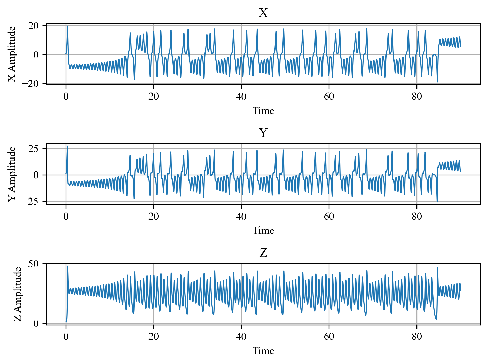
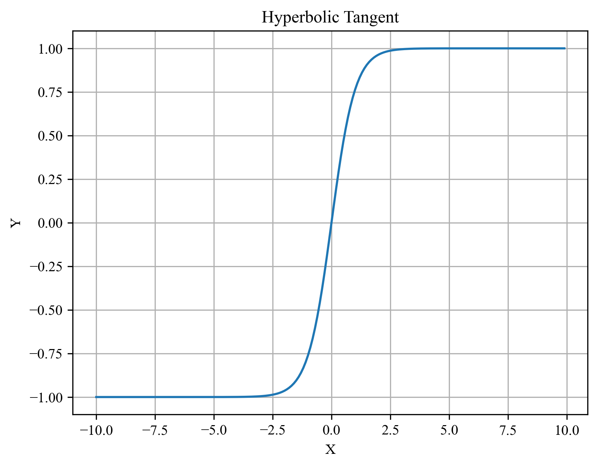

# Reservoir Computing & The Lorenz System

## Motivation

## Theory
### Reservoir Computing

The equation for the Leaky Integrator Echo State Network is: 

$$
x(t) = (1-a)x(t) + a\times \tanh(W_{in}u(t) + \hat{W}x(t-1))
$$

This equation can also be described by considering tha matrix dimensions: 

$$
[I][I\times R][R \times O] = [O]
$$


### The Lorenz System

$$
\begin{split}
\frac{dx}{dt} & = \sigma (y-x) \\
\frac{dy}{dt} & = x(\rho - z) - y\\
\frac{dz}{dt} & = xy - \beta z\\
\end{split}
$$

The standard weights for the Lorenz System is shown in the following table.

| $\sigma$ | $\rho$ | $\beta$ |
| ------ | ------ | ------ |
| $10$ | $28$ | $\frac{8}{3}$ | 


## Methods
### Setting up the Python Environment

The package requirements are minimal for this project. The only packages necessary are `numpy`, `scipy` and `matplotlib`


```python
import numpy as np
import matplotlib.pyplot as plt
from scipy.integrate import solve_ivp
```

### Modeling the Lorenz System

The next step in this project is to create our training data for the Lorenz system. In this section, we will use a Runge-Kutta-4 solver to simulate the Lorenz system. To start, create the following function whose input arguments correspond with the coeffecients of the Lorenz equations.

```python
def lorenz(t, vars, rho, sigma, beta):
    x, y, z = vars

    variable_vector = np.array([x, y, z, x*z, x*y])

    weights = np.array([[-sigma, sigma, 0, 0, 0],
                         [rho, -1, 0, -1, 0],
                         [0, 0, -beta, 0, 1]])

    # Perform matrix multiplication to obtain the Lorenz equations
    return weights@variable_vector

```

Next, define the three variables. You will notice that instead of using round numbers like $28$ and $10$ we use approximately those values. This is a little trick that we can play to make sure our simulation doesn't round as much.


```python
# These are the historical weights from the original Lorenz System 
rho = 27.999999
sigma = 9.999999
beta = 8/3
```

Now we need to define the duration, sampling rate and initial conditions for the system. We will use a random number to instantiate the $x$ initial condition. This will ensure that every time we run this simulation, we get a different time series. 

```python
t_start = 0
t_stop = 250

dt = 0.01

t_span = [t_start, t_stop]
t_eval = np.arange(t_start, t_stop, dt)
initial_conditions = [np.random.rand(), 1, 1]
```

Now that all of our parameters have been defined, all that is left to do is run the simulation and collect our data. For convenience, we will also take the solution and break it down into the appropriate variables.

```python
lorenz_soln = solve_ivp(lorenz, t_span, initial_conditions, t_eval= t_eval, args=(rho, sigma, beta))

time = lorenz_soln.t
x = lorenz_soln.y[0, :]
y = lorenz_soln.y[1, :]
z = lorenz_soln.y[2, :]

```

At this point, we have now created the time series data that we can use to train our LI-ESN model. Before we move on to creating the reservoir computing model, let's make some plots of our data to visualize this system.

We have already seen the 3D butterfly attractor for this system, so let's plot the time series for the $x$, $y$ and $z$ channels. One key observation about this time series plot is that the $x$ and $y$ channels exhibit antipodal symmetry.



### Data Preprocesing

Now that we have created the data set for the Lorenz system, we need to apply some processing operations before we can train on this data. 

### Scaling

The first operation we need to perform on our data is to scale it to the range $[-1, +1]$. Recall that in the equation for the LI-ESN model we have a hyperbolic-tangent function. The following figure shows the plot of $y = tanh(x)$. Notice that for large $\|x\|$ the function is almost a constant. We want the inputs of our system to exist in the nonlinear region of the function and not on the near-constant tails.




The following code centers and scales the data from the lorenz system. 

```python
x_scaling_factor = np.abs(np.max(x))
y_scaling_factor = np.abs(np.max(y))
z_scaling_factor = np.abs(np.max(z))

x_amp_shift = np.mean(x)
y_amp_shift = np.mean(y)
z_amp_shift = np.mean(z)

print("X Scaling: ", x_scaling_factor)
print("Y Scaling: ", y_scaling_factor)
print("Z Scaling: ", z_scaling_factor)

lorenz_data = np.copy(lorenz_soln.y)

lorenz_data[0, :] -= x_amp_shift
lorenz_data[1, :] -= y_amp_shift
lorenz_data[2, :] -= z_amp_shift

# Now apply the scaling factor to our data.
lorenz_data[0, :] /= x_scaling_factor
lorenz_data[1, :] /= y_scaling_factor
lorenz_data[2, :] /= z_scaling_factor
```


### Creating a Leaky Integrator Echo State Network in Python

#### Test

This section of the article will provide a step-by-step walk through on how to use Python to create a Leaky Integrator Echo State Network.


