# Desk Lamp Assembly Instructions

The following document lists the assembly instructions for a desk lamp. The lamp design can be printed on a mini-sized printer (180x180x180) and was created to use a recycled lamp socket.

Step files for this project can be found: https://www.printables.com/model/1413544-desk-lamp-for-mini-printers

## Parts & Printing Quantities

Print out the following quantities of each file: 
- 3x Leg.step
- 1x Cap.step
- 1x Shade.step
- 1x Base.step
- 6x Side_Mesh.step

Below are the required fasteners and quantities:
- 21x M3 threaded inserts*
- 21x M3x5mm fasteners*

\* Note: The design has locations for 21x fasteners. In practice, only 12x are needed. 

You will also need 1x lamp socket. The design accommodates a 36mm in diameter socket.  

Optional: 3x6mm diameter rubber feet

## Threaded Inserts

Place at least 3x threaded inserts in the shade: 

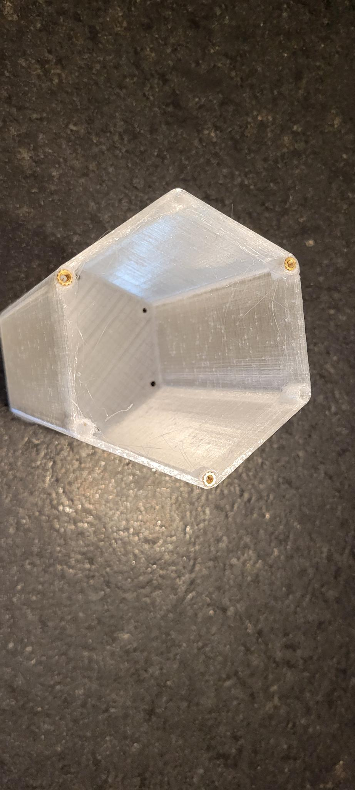

Place at least 3x threaded inserts in the cap: 

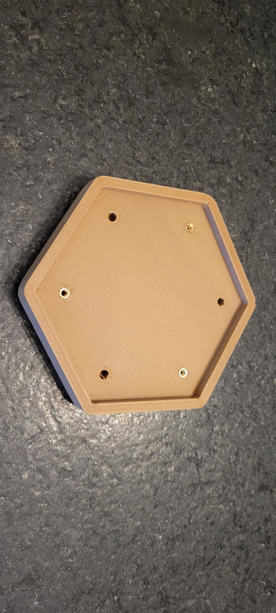

Place at least 2x threaded inserts in each leg: 

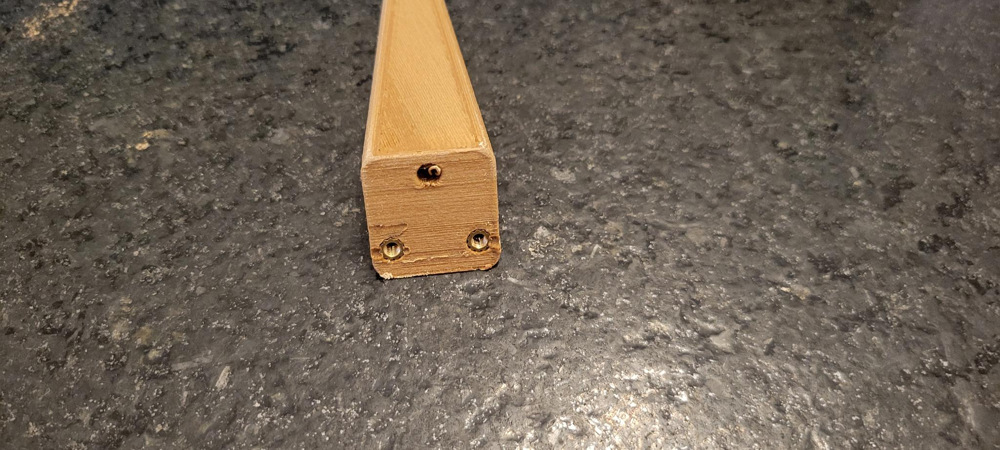

(*Optional) Attach a rubber foot to the bottom of each leg: 

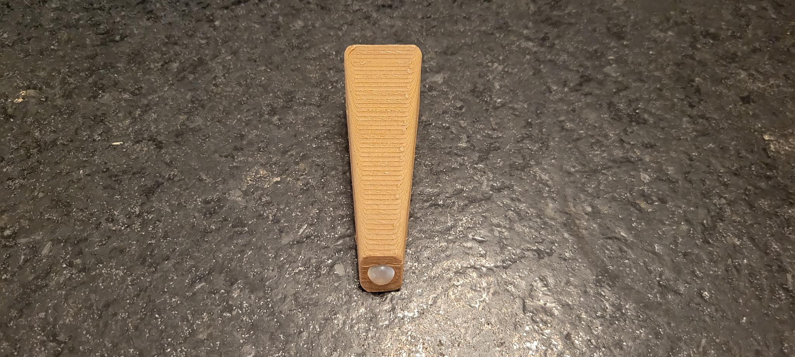

## Assembly

### Attach Shade to Cap

Parts required: 
- Shade
- Cap
- At least 3x fasteners

Use 3x fasteners to attach the shade to the cap: 

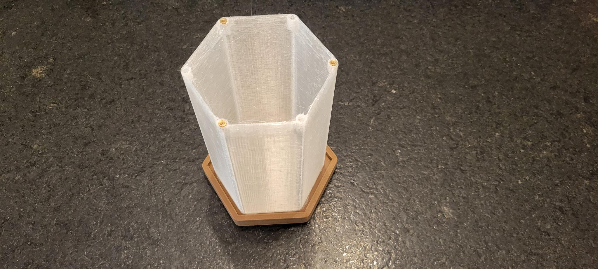

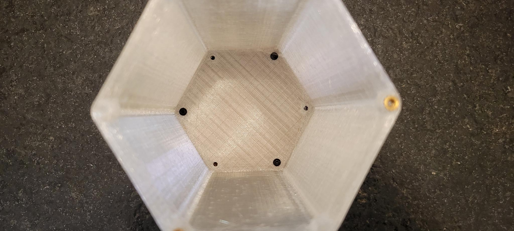

### Legs, Base, Lamp Socket

Parts required: 
- 3x Legs
- Base
- Lamp Socket
- At least 6x fasteners

Mount the lamp socket in the base: 

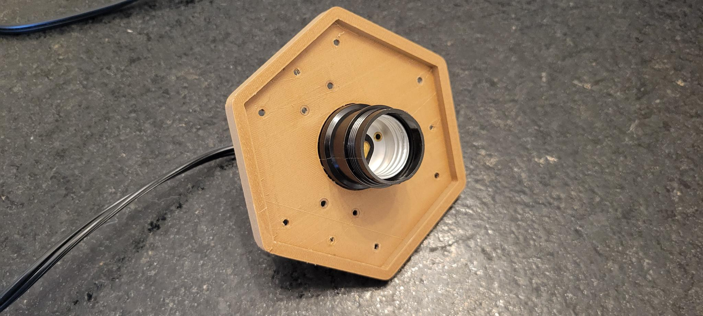

Next, using at least 2x fasteners per leg, attach the legs to the base: 

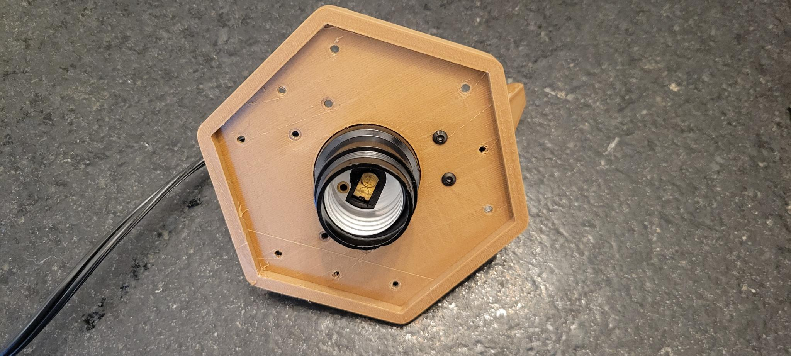

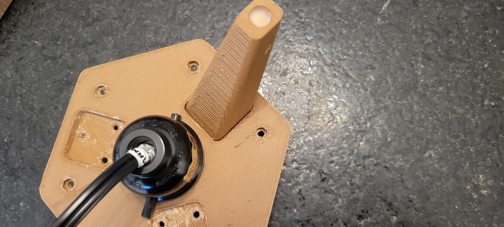

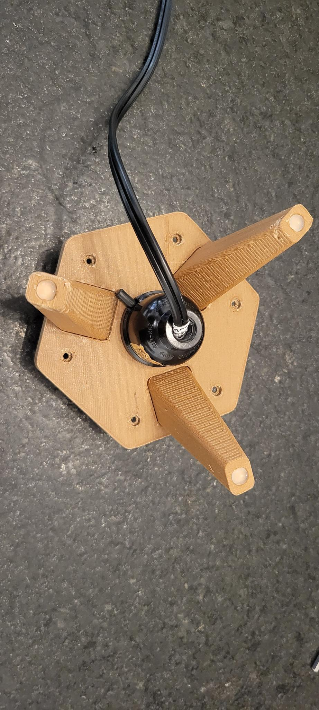

At this time, install the lightbulb into the socket.

### Final Assembly

Parts required: 
- Base + Leg Assembly
- Cap + Shade Assembly
- 6x Side panels
- At least 3x fasteners

With the Cap + Shade assembly upside down, place the side panels along each side of the shade as shown below: 

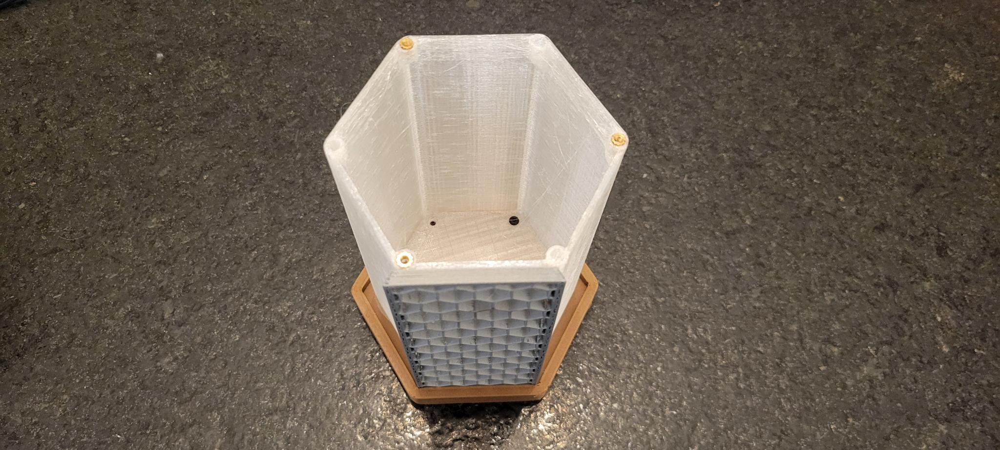

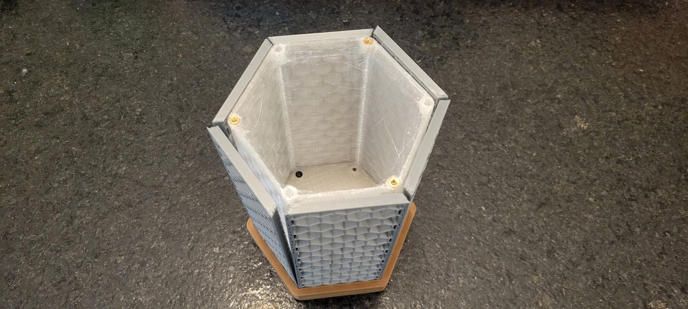

Now lower the Base + Leg assembly so that each side panel is captured by the Base: 

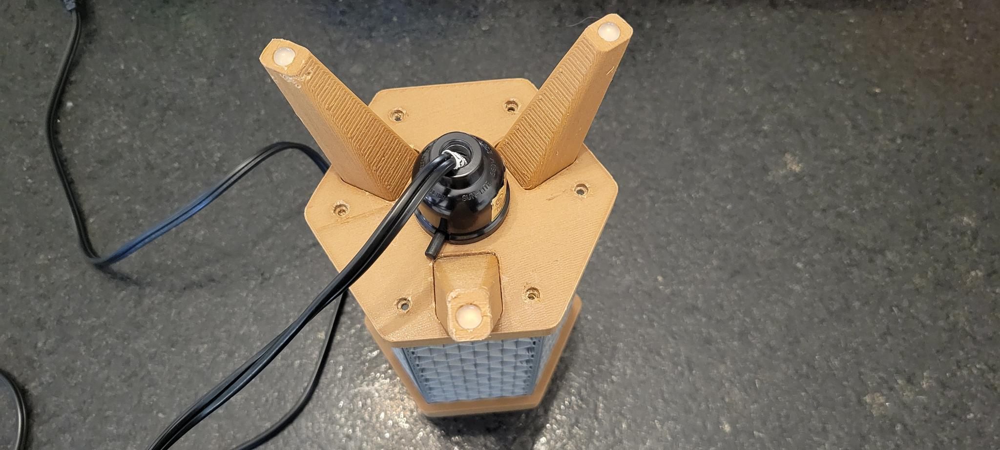

Finally, attach the base to the shade with at least 3x fasteners: 

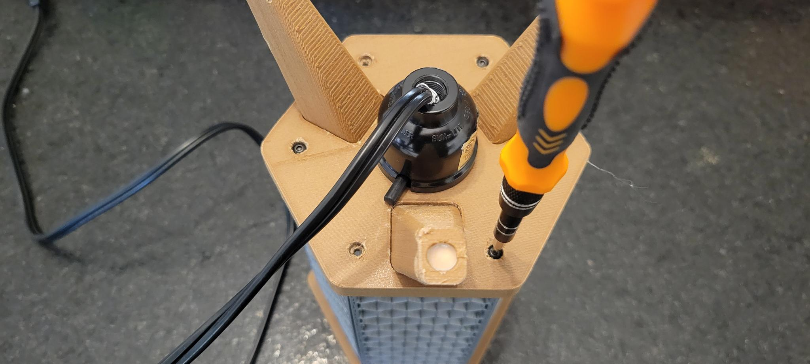

Turn the lamp right-side up and the assembly is complete: 

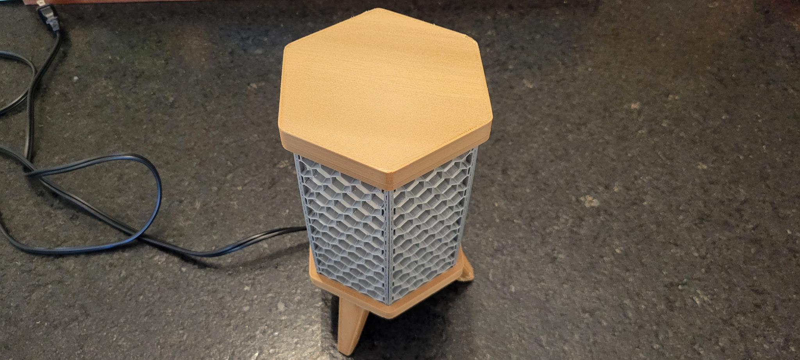

