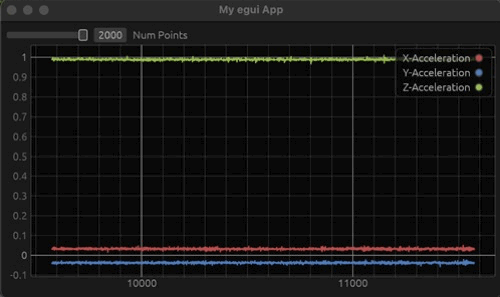
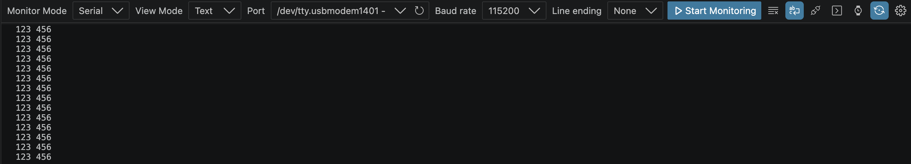
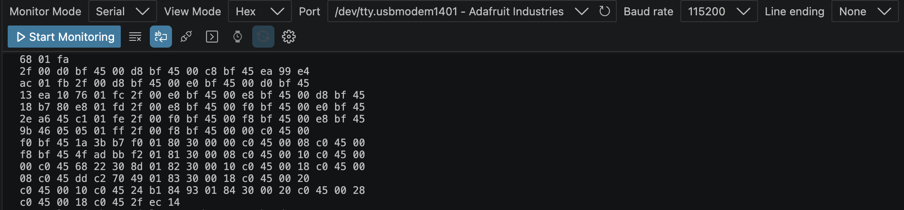
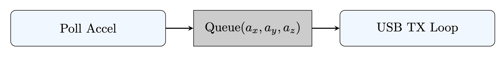

# Bare Metal Rust Application



## Motivation

By the end of this article, we will have created bare metal application that polls an accelerometer, streams the data over USB to a hosted application that plots the data. Through the process of writing this firmware and plotting application, we will cover various Rust topics such as Cargo workspaces, std and no-std development environments, and data serialization with the Postcard crate. The same functionality that will be developed in this article can be implemented with just a few lines of code in higher level languages such as CircuitPython, writing an implementation in a lower level language such as Rust provides a useful learning opportunity to explore embedded development concepts in a new language. 

Adafruit has posted a great article about creating this project in CircuitPython: [CircuitPython Made Easy on Circuit Playground Express and Bluefruit](https://learn.adafruit.com/circuitpython-made-easy-on-circuit-playground-express/acceleration)


## Article Structure:

The article walks through the iterative development process. As such, the code presented in each of the sections is not meant to be perfect production code. Instead, each section will present a minor, iterative improvement working towards finalized code. While the article itself will only discuss the main points of each step, each section links to the corresponding commit so readers can examine the incremental changes introduced at that stage of development.

- Part 1: Project Setup
    - The first part of this project will focus on setting up the workspaces for the firmware and the receiver, and creating our shared accelerometer message. 
- Part 2: Firmware
    - Once the initial project setup is complete, we will write the firmware to read from the accelerometer and stream that data using the virtual com port and the USB bus. 
- Part 3: Receiver and Plotter
    - Once we have the data streaming functionality written on the CPX, we will transition to writing the receiving and plotting application. 
    - Additionally, this section will cover the creation of a simulation tool that can send dummy accelerometer data when the CPX hardware is not available.
- Part 4: Improving Performance and Resolving Issues
    - Finally, once the core functionality is fleshed out, we can focus on increasing the data transfer rates and updating the code with quality of life improvements.

## Hardware Overview

The hardware used for this project is a [Circuit Playground Express](https://www.adafruit.com/product/3333). 
- The processor on this device is an ATSAMD21
- The accelerometer on this device is a LIS3DH. 

## A Note About RTIC

The use of RTIC was a notable difference when comparing bare-metal C to bare-metal Rust. The following is a common pattern to handle interrupts in bare-metal C:

```c

volatile uint32_t shared_counter = 0;
volatile bool data_ready = false;

void UART_IRQHandler(void) {
    shared_counter++; 
    data_ready = true;
}

int main(void) {
    // Some hardware initialization here

    while (1) {
        if (data_ready) {
            __disable_irq(); 
            
            uint32_t current_value = shared_counter;
            data_ready = false;
            
            __enable_irq(); 

        }
    }
}
```

In the above code, `main()` polls the `data_ready` flag and only processes `shared_counter` when the `UART_IRQHandler` says it's ready. It's important to include the `__disable_irq` and `__enable_irq` avoid a conflicting memory access by main and the interrupt handler. 

Using RTIC, this same code would look like: 

```rust
#[rtic::app(device = some_device, peripherals = true)]
mod app {
    // The shared resources structure
    #[shared]
    struct Shared {
        counter: u32,
    }

    #[local]
    struct Local {}

    #[init]
    fn init(cx: init::Context) -> (Shared, Local, init::Monotonics) {
        // Initialize the shared resource safely without globals
        (Shared { counter: 0 }, Local {}, init::Monotonics())
    }

    #[task(binds = UART0, priority = 2, shared = [counter])]
    fn uart_isr(mut cx: uart_isr::Context) {
        // Higher priority task can access the resource directly 
        // if no lower priority task is locking it.
        cx.shared.counter.lock(|counter| {
            *counter += 1;
        });
    }

    #[task(priority = 1, shared = [counter])]
    fn background_processor(mut cx: background_processor::Context) {
        cx.shared.counter.lock(|counter| {
            let current_value = *counter;
        }); 
    }
}

```

Notice that in the above code, there is an explicit lock on the shared counter. Even though the `uart_isr` function has a higher priority than the `background_processor`, the lock means that there will never be conflicting memory access to `counter`. Since RTIC relies on the hardware interrupt controller, the software overhead is minimal. What is also interesting about the use of RTIC is that it allows for the creation of `async fn` software tasks that are still hardware driven. RTIC provides opens the possibility for some very interesting async capabilities that present a different mental model for bare-metal programming in Rust. For more information, here is the repo for [rtic-rs](https://github.com/rtic-rs/rtic).

## Crates Overview

### Bare Metal Crates

Below are the crates used for the hardware portions of this project:
- Hardware Abstraction Layer
    - [ATSAMD-HAL](https://crates.io/crates/atsamd-hal)
- Accelerometer Crate
    - [LIS3DH](https://crates.io/crates/lis3dh)

### Other Crates

Below are the crates used for data plotting and serialization:
- Data Serialization:
    - [Postcard](https://crates.io/crates/postcard)
- Plotting Crate:
    - [Egui Plot](https://crates.io/crates/egui_plot)

## Part 1: Project Setup

### Workspace Initialization

Step Diffs: [Workspace Initialization](https://github.com/mattantseng-0/rust_cpx_accel_rx_tx/compare/224597734f99f05dc2a84728e3708da79ecf4a37...cb757fd6660f9731bcf793b1702d525b6f387df8)

Begin by creating Cargo workspaces with the following file structure: 
```
.
├── Cargo.toml
├── firmware
│   ├── Cargo.toml
│   └── src
│       └── main.rs
├── plotting_app
│   ├── Cargo.toml
│   └── src
│       └── main.rs
├── README.md
└── shared
    ├── Cargo.toml
    └── src
        └── lib.rs
```

In your top level Cargo.toml enter the following: 
```rust
[workspace]
resolver = "3"
members = [
    "firmware",
    "plotting_app",
    "shared"
]

```

Cargo workspaces are important because the `plotting_app` is written for a hosted environment (std) whereas the `firmware` is written for a bare-metal target (no-std). Since both the `plotting_app` and the `firmware` make use of the same `acc_msg` struct, Cargo workspaces allow us to cleanly build the shared code for different targets.

For detailed information about Cargo Workspaces, I would recommend reading the related Rust documentation page: [14.3: Cargo Workspaces](https://doc.rust-lang.org/book/ch14-03-cargo-workspaces.html)

### Message Setup
Step Diffs: [Message Definition](https://github.com/mattantseng-0/rust_cpx_accel_rx_tx/commit/ca24390728a566a0bab9c658cbbb368936823b56)

Once the workspaces are setup, we will begin by defining the interfaces that are used by both the `plotting_app` and the firmware.

Create new files so that your `shared` directory has the following structure:

```
shared
├── Cargo.toml
└── src
    ├── lib.rs
    └── messages
        ├── acc_msg.rs
        ├── message_id.rs
        ├── message.rs
        └── mod.rs
```

Add the following to the `Cargo.toml`

```rust
[package]
name = "shared"
version = "0.1.0"
edition = "2024"

[features]
default = ["std"]
# When 'std' is active, it passes standard library support to serde
std = ["serde/std"] 

[dependencies]
serde = {version = "1.0.228", default-features = false, features = ["derive"] }
serde_repr = "0.1.20"
```

Importantly, we define the shared package to have an std feature. By marking this as a feature, we will be able to use shared in an std and no-std environments: necessary for hosted and bare-metal code. 

Before we write the firmware or plotting application, let's begin by defining the message used to stream the accelerometer data from our CPX to the plotter. For our accelerometer data, we will define a serializable struct that contains the following information: 

```rust
#[derive(Serialize, Deserialize, Debug, Default)]
pub struct AccMsg {
    pub id: MessageId, 
    pub counter: u16,
    pub acc_x: i16,
    pub acc_y: i16,
    pub acc_z: i16, 
}
```

While the inclusion of the MessageID field is unnecessary for this exercise, it will allow for future introductions of additional message types. 


## Part 2: Firmware
### Basic Data Transfers

Step Diffs: [Basic Serial Writing](https://github.com/mattantseng-0/rust_cpx_accel_rx_tx/commit/d14d39b990380cb7829f4a3f3f15f7d11b9e4c34)

Once the shared message interfaces have been defined, we will transition to writing the firmware for the CPX. Before we write any code, it is necessary to define the target architecture of the target. 

Run the following command to add the necessary target architecture:
```
rustup target add thumbv6m-none-eabi
```

Next, follow the instructions from the ATSAMD repo to build/deploy a basic blinky script to the CPX [circuit_playground_express](https://github.com/atsamd-rs/atsamd/tree/master/boards/circuit_playground_express). This will help you get familiar with the hf2 tool. 

Once you have successfully built and deployed an example script to the CPX, we can continue to set up our development environment. 

Write the following to your `Cargo.toml`:

```rust
[package]
name = "firmware"
version = "0.1.0"
edition = "2024"

[dependencies]
panic-halt = "0.2"
cortex-m = { version = "0.7", features = ["critical-section-single-core"] }
circuit_playground_express = {version = "0.12.1", features = ["default","rtic", "usb"]}
rtic = { version = "2.1.1", features = ["thumbv6-backend"] }
usb-device = "0.3.2"
usbd-serial = "0.2.2"
```

The hardware setup for the USB virtual com port is derived from the usb_serial example in the ATSAMD crate: [usb_serial.rs](https://github.com/atsamd-rs/atsamd/blob/master/boards/circuit_playground_express/examples/usb_serial.rs). 

One of the most critical pieces of this example is the `poll_usb` function. For this project, we will use a stripped down version of this function. The core of this function is to periodically check the USB bus to see if there is a pending action. In our case, the pending action will be to transmit data from the accelerometer.

```rust
#[task(binds = USB, shared = [usb_bus, usb_serial])]
fn poll_usb(cx: poll_usb::Context) {
    let mut serial = cx.shared.usb_serial;
    let mut usb_bus = cx.shared.usb_bus;

    (&mut serial, &mut usb_bus).lock(|s, b| {
        if !b.poll(&mut [s]) {
            return;
        }
    })
}
```

Next, we define an async function to send data out of the virtual com port: 

```rust
#[task(shared = [usb_serial])]
async fn usb_tx_loop(mut cx: usb_tx_loop::Context)
{
    loop {

        let serialized_slice:&[u8] = b"123 456\n";

        cx.shared.usb_serial.lock(|serial| {
            let _ = serial.write(serialized_slice);
        });

        Mono::delay(100u64.micros()).await;
    }
}
```

In order for the `usb_tx_loop` to transmit data, it must have access to the `usb_serial` device. This is accomplished by adding the `usb_serial` device to `shared`. When you deploy this code, you should be able to see `123 456` being written in a serial listener: 




### Sending Dummy Accelerometer Data

Step Diffs: [CPX send dummy accel msg](https://github.com/mattantseng-0/rust_cpx_accel_rx_tx/commit/6bbbf7c5867254bcb0fd58806f1485a21a126183)

Now that our CPX is able to stream basic data, we can bring in our accelerometer message definition and send a dummy struct. Even though we are not reading any data from the accelerometer yet, sending this dummy struct allows us to create the plumbing that will be necessary to transmit the real accelerometer values. Update your `Cargo.toml` as follows: 

```diff
[package]
name = "firmware"
version = "0.1.0"
edition = "2024"

[dependencies]
panic-halt = "0.2"
cortex-m = { version = "0.7", features = ["critical-section-single-core"] }
circuit_playground_express = {version = "0.12.1", features = ["default","rtic", "usb"]}
rtic = { version = "2.1.1", features = ["thumbv6-backend"] }
usb-device = "0.3.2"
usbd-serial = "0.2.2"
+ postcard = {version = "1.1.3", default-features = false, features = ["heapless", + "use-crc"]}
+ crc = "3.4.0"
+ serde = { version = "1.0", default-features = false, features = ["derive"] }
+ shared = { path = "../shared", default-features = false }
```

Note that this update to the `Cargo.toml` sets the `default-features = false` in our shared include. Recall that we made our `std` dependency configurable in `shared`. By setting `default-features = false`, we do not rely on `std` making shared compatible with bare-metal.

Next, update the `usb_tx_loop` function as follows: 

```rust
#[task(shared = [usb_serial])]
async fn usb_tx_loop(mut cx: usb_tx_loop::Context)
{
    let counter: u16 = 0;
    let mut tx_msg = AccMsg::new();
    let mut output_buffer = [0u8; core::mem::size_of::<AccMsg>() + 4];
    loop {

        tx_msg.acc_x = (tx_msg.counter as i16);
        tx_msg.acc_y = (tx_msg.counter as i16) + 1i16;
        tx_msg.acc_z = (tx_msg.counter as i16) - 1i16; 

        let serialized_slice = postcard::to_slice_crc32(
            &tx_msg, 
            &mut output_buffer, 
            CRC_ALGO.digest()
        ).expect("Serialization failed");

        cx.shared.usb_serial.lock(|serial| {
            let _ = serial.write(serialized_slice);
        });

        Mono::delay(100u64.micros()).await;
    }
}
```

Once again, we can use a serial monitor tool to read our data. 



In the updated code, the postcard crate is used to calculate a CRC on the contents of our message. Since USB packets already include link-layer error correction, including the CRC in the application packet is not strictly necessary. However, we will keep it here to help detect software bugs, data errors pre-serialization, or corrupted application data.

---

*Correction: The following line is incorrect and will result in an invalid memory access.*
```rust
let mut output_buffer = [0u8; core::mem::size_of::<AccMsg>() + 4];
```

*If we were directly serializing the data in the AccMsg struct and appending a 4 byte CRC to the end of it, then this line would not cause any problems. However, serialization with the Postcard crate results in a variable length byte array which can exceed the length of the raw data contained in the struct. The failure mode caused by this error will look like data streams from the CPX without issue and then if you move the device, it will panic and halt.*

*A simple change that resolves this issue is to update the `output_buffer` declaration as follows:*

```rust
const MAX_MSG_SIZE: usize = 32;
let mut output_buffer = [0u8; MAX_MSG_SIZE];
```

*Alternatively, the Postcard crate has an experimental trait `MaxSize` that could be implemented for the AccMsg. you can read more about that here: [MaxSize](https://docs.rs/postcard/latest/postcard/experimental/max_size/trait.MaxSize.html)*

---

### Communicating with the Accelerometer

Step Diffs: [Read and Stream Accel Data](https://github.com/mattantseng-0/rust_cpx_accel_rx_tx/commit/298a4d83478887ec7eb1d1a9927bb20f9dae2e43)

At this point in the project, we have all of the message plumbing in place to stream our formatted message out of the virtual com port. At this point in the project, we can introduce the accelerometer. 

In order to keep the tx code separate from the accelerometer reading logic, we will introduce a new asynchronous function `poll_accel` that is a producer into a data queue. Then, we will update the `usb_tx_loop` to consume from the queue and send it out. 



The following async function is responsible for reading from the accelerometer:

```rust
    #[task(local = [lis3dh], shared = [data_queue])]
    async fn poll_accel(mut cx: poll_accel::Context)
    {
        loop {


            if let Ok(sample) = cx.local.lis3dh.accel_raw() {
                cx.shared.data_queue.lock(|queue| {
                    let _ = queue.enqueue((sample.x, sample.y, sample.z));
                });
            } else {
                cx.shared.data_queue.lock(|queue| {
                    let _ = queue.enqueue((-1i16, -1i16, -1i16));
                });
            }
        
            Mono::delay(1u64.millis()).await;
        }
    }
```

Next, update the `usb_tx_loop` to dequeue the accelerometer data: 

```rust
    #[task(shared = [usb_serial, data_queue])]
    async fn usb_tx_loop(mut cx: usb_tx_loop::Context)
    {
        let mut counter: u16 = 0;
        let mut tx_msg = AccMsg::new();
        let mut output_buffer = [0u8; core::mem::size_of::<AccMsg>() + 4];
        loop {

            let data = cx.shared.data_queue.lock(|queue| queue.dequeue());

            if let Some((raw_x, raw_y, raw_z)) = data {
                tx_msg.acc_x = raw_x;
                tx_msg.acc_y = raw_y;
                tx_msg.acc_z = raw_z; 

            } else {
                tx_msg.acc_x = -1i16;
                tx_msg.acc_y = -1i16;
                tx_msg.acc_z = -1i16; 
            }

            let serialized_slice = postcard::to_slice_crc32(
                &tx_msg, 
                &mut output_buffer, 
                CRC_ALGO.digest()
            ).expect("Serialization failed");

            cx.shared.usb_serial.lock(|serial| {
                let _ = serial.write(serialized_slice);
            });
            
            counter = counter.wrapping_add(1);

            Mono::delay(100u64.micros()).await;
        }
    }
```

## Part 3: Receiver and Plotter
### Preliminary Data Plotting

Step Diffs: [Basic Accelerometer Data Plotting](https://github.com/mattantseng-0/rust_cpx_accel_rx_tx/commit/2fbed2e28dd9a3c62287eb876ccad600e8799635)

Now that we have an initial implementation to stream accelerometer data from the CPX, we can transition to the message receiver and plotter. Before we begin writing the actual receiver. The core handling of the rx buffer can be seen below: 

```rust
while read_fifo.len() > std::mem::size_of::<AccMsg>() + 4  {
    match take_from_bytes_crc32::<AccMsg>(&read_fifo, CRC_ALGO.digest()) {
        Ok((parsed_msg, remaining)) => {
            println!("remaining.len(): {:?}", remaining.len());
            rx_data.push_front(parsed_msg);
            *read_fifo = remaining.to_vec();
            got_new_data = true;
            *num_msgs = num_msgs.wrapping_add(1);

            println!("rx_data.len(): {:?}", rx_data.len());
            if rx_data.len() > num_points as usize {

                rx_data.truncate(num_points as usize);
            }
        }
        Err(e) => {
            println!("Error: {:?}", e);
            // If there's a decoding issue, then assume misalignment and drop the 0th entry to attempt to realign
            read_fifo.remove(0);
            break;
        }
    }
}
```

The important part of this code snippet is the use of the `take_from_bytes_crc32`. During the firmware section of this project, we used the sibling function call `to_slice_crc32` but did not discuss the motivation for using these Postcard functions. There are two primary reasons for using this function. First, the function ensures that a `0x00` can be used as the frame delimiter.  Second, the receiver decodes the CRC value and returns an error if the CRC value does not match. 

This initial plotting implementation is crude because the gui rendering and the data processing are running in the same thread and often block each other. In practice, this conflict means that the GUI will not update until a new message is received. 

### Creating a Data Simulation Tool

Step Diffs: [Simulated data sender](https://github.com/mattantseng-0/rust_cpx_accel_rx_tx/commit/2f8e833c14b1df30a829949ab864d790d8150a15)

While this step is not necessary to receive and plot data from the CPX, we are now going to write another simple rust script to emulate the data being sent from the CPX and feed it into our receiver. One reason for doing this is to be able to update and improve the receiver without needing access to the CPX hardware. Another reason for creating this simulation tool is to allow for stress testing and fault injection in the data stream to make sure that our receiver is robust. 

In order to get serial data from one application to another, we will use Socat to virtually connect 2 devices. Run the following command: 

```bash
socat -d -d pty,raw,echo=0 pty,raw,echo=0
```

The output will look similar to the following:

```bash
 % socat -d -d pty,raw,echo=0 pty,raw,echo=0
2026/06/24 11:06:14 socat[79889] N PTY is /dev/ttys038
2026/06/24 11:06:14 socat[79889] N PTY is /dev/ttys049
2026/06/24 11:06:14 socat[79889] N starting data transfer loop with FDs [5,5] and [7,7]
```

We now have a connection between `/dev/ttys038` and `/dev/ttys049`. 

To setup a separate executable that can still be run with cargo, we will add the following to your Cargo.toml:

```
default-run = "plotting_app"
```

The above line will allow you to still use `cargo run` to execute the primary plotting application. Then, to run the tx_sim application, use the command: 
```
cargo run --bin tx_sim
```

You will need to manually update the `port_name` definition to match the devices that Socat connected.

Once we have our tx_sim setup, we can inject some errors to test the reTwo of the cases that we can check are:
- Message misalignment
- Corrupted message

In order to test for message misalignment, we include the following code in our TX sim:

```rust
// every 10th message inject some garbage data. This is to test that the rx 
// can resync after a misalignment
if counter % 10 == 0
{
    port.write_all(&random_bytes)
    .expect("Write failed");
}
```

To test the ability of the receiver to recover from a corrupted message, we include the following code in the TX sim: 

```rust
let serialized_slice = postcard::to_slice_crc32(
    &tx_msg, 
    &mut output_buffer, 
    CRC_ALGO.digest()
).expect("Serialization failed");

// Every 100 messages flip a byte after the crc calculation. 
// This is to check the rx behavior on corrupted data
if counter % 100 == 0 {
    serialized_slice[3] = !serialized_slice[3];
}
```
## Part 4: Improving Performance and Resolving Issues

### Separate Render and RX Threads
Step Diffs: [Multithread plotting and rx app](https://github.com/mattantseng-0/rust_cpx_accel_rx_tx/commit/a9d67beaec5dd6c873f75036c51d31448ed19b31)

Currently, the plotting app is receiving data and plotting it in the same thread. An easy update to improve performance is to separate the message handling and the rendering into two threads. To perform this separation, we can make use of the Multiple Producer Single Consumer (MPSC) module. Consider the following example code: 

Producer:
```rust
pub fn spawn_test_producer_thread(tx: Sender<AccMsg>) {
    let mut my_counter: u16 = 0;
    
    loop {
        println!("Producer count: {}", my_counter);
        let mut tx_msg = AccMsg::new();
        tx_msg.counter = my_counter;

        tx.send(tx_msg);
        
        my_counter = my_counter.wrapping_add(1);
        thread::sleep(Duration::from_millis(1));

    }

}
```

Consumer:
```rust
pub fn spawn_test_consumer_thread(rx: Receiver<AccMsg>) {

    println!("spawn_test_consumer_thread loop");

    loop {
        while let Ok(msg) = rx.try_recv() {
            println!("Consumer count: {}", msg.counter);
        }
        thread::sleep(Duration::from_millis(1));
    }
}
```

Main:
```rust
fn main() {

    let (tx, rx) = mpsc::channel::<AccMsg>();

    println!("Hello, world!");

    let producer = thread::spawn(move || spawn_test_producer_thread(tx));
    let consumer = thread::spawn(move || spawn_test_consumer_thread(rx));

    producer.join().unwrap();
    consumer.join().unwrap();
}
```

With these three code snippets, the producer pushes an AccMsg into a the mpsc channel that is then used by the consumer. While this is a trivial example, the concepts can be applied to our plotting app. The restructure to split up the receiver into multiple threads is also an excellent time to break out the functionality of our app.

Update the structure of the plotting app as follows:

```
plotting_app
├── Cargo.toml
└── src
    ├── bin
    │   └── tx_sim.rs
    ├── app.rs
    ├── main.rs
    └── serial.rs
```

The code in `app.rs` will be responsible for rendering the graph. `main.rs` will be responsible for spawning the threads and `serial.rs` will be responsible for receiving the data. 

### Runtime Arguments

Step Diffs: [Runtime Arguments](https://github.com/mattantseng-0/rust_cpx_accel_rx_tx/commit/e2f1d6681a100c32b996c825bf8ea0ad852cdb0a)

The next improvement we can make is to use runtime arguments to select the device used by the receiver. Using runtime arguments means that we won't have to use hardcoded values.

By adding this snippet, we can make the device selection configurable and provide a help menu in case we want to add more information in the future: 

```rust
while let Some(arg) = args.next() {
    match arg.as_str() {
        "-d" | "--device" => {
            if let Some(val) = args.next() {
                serial_interface = Some(val);
            } else {
                eprintln!("No device given with device flag");
                std::process::exit(1);
                
            }
        }
        _ | "-h" | "--help" => {
            println!("-h help: print help menu\n-d device: /dev/ttySomeDevice");
            std::process::exit(1);

        }
    }
}
```

## Conclusion

During this article, we have walked through the creation of a pair of Rust applications that use a shared messaging interface to poll an accelerometer, transmit that data over USB and plot the data as it is received. To complete this excercise, the following was accomplished: 
- Used Cargo workspaces to cleanly compile shared Rust for std and no-std environments
- Leveraged multi-threading to efficiently receive and plot the data
- Discussed RTIC to create interrupt driven firmware
- Created a simulation framework to inject faults into the received data to test robustness

The next step for this project is to do more than just plot the accelerometer data. One possible use for the accelerometer data is to feed it into a Recursive Bayesian filter for state estimation.
